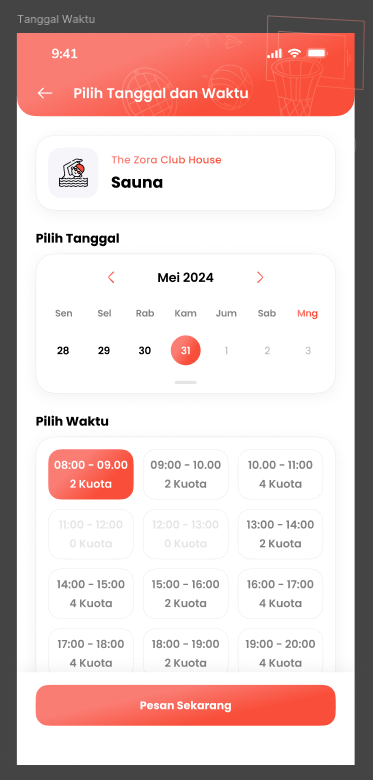
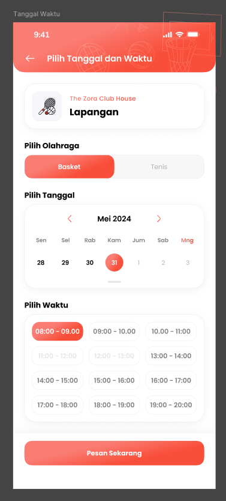
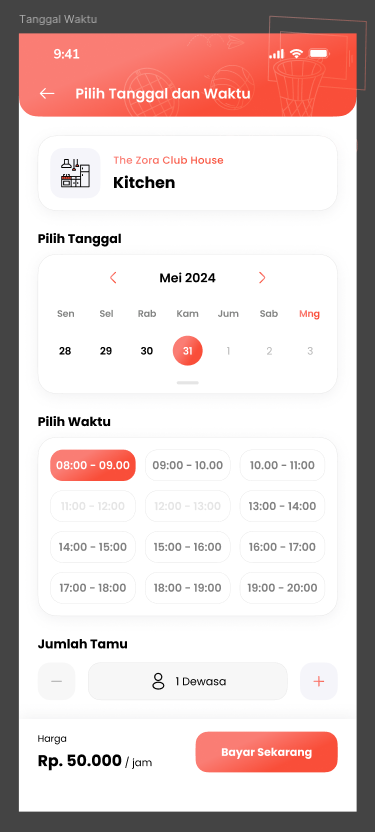

# Enhancement Club-House The ZORA

Secara singkat, ada beberapa _enhancement_ penting pada club house untuk The ZORA, antara lain:

1. Menampilkan Quota
2. Pemilihan Jenis Lapangan
3. Kitchen Berbayar dan Jumlah Tamu

<!-- truncate -->

## Menampilkan Quota

Menampilkan `quota` pada servis **Sauna**.



Hal tersebut bisa didapatkan dari endpoint `/get-clubhouse-schedule-time` dengan objek-objek berikut:

- `show_quota` = **true**
- `quota` = **5**
- `quota_label` = **'Kuota'**

Berikut contoh _response_-nya:

```
{
  "success": true,
  "msg": "Success",
  "data": {
    "member_quota": 1,
    "schedule_time": [
      {
        "schedule_id": 354723,
        "date": "2025-08-18",
        "time": "19:00 - 19:45",
        "hours": 0,
        "is_resident": 1,
        "quota": 5,
        "quota_label": "Kuota",
        "show_quota": true,
        "price": 0,
        "is_active": true
      }
    ],
    "existing_member": [
      {
        "name": "REZA NURFACHMI",
        "photo": "https://az-sto.onesmile.digital/onesmile/img/photo/avatar.png",
        "picked_time": "07:00"
      },
      {
        "name": "REZA NURFACHMI",
        "photo": "https://az-sto.onesmile.digital/onesmile/img/photo/avatar.png",
        "picked_time": "07:00"
      }
    ]
  }
}
```

## Pemilihan Jenis Lapangan

Customer dapat memilih jenis olahraga yang diinginkan saat menyewa lapangan.



Hal tersebut bisa didapatkan dari endpoint `/get-clubhouse-detail` dengan objek-objek berikut:

- `services.label`: **"Pilih Olahraga"**
- `services.options`: **["Basket", "Tenis"]**

Berikut contoh _response_-nya:

```
{
  "success": true,
  "msg": "Success",
  "data": {
    "service_id": 85,
    "location_id": 129,
    "category": "Lapangan",
    "name": "The ZORA",
    "address": "Tangerang Regency, Banten",
    "time": "(Buka pada 07:00)",
    "time_status": "Tutup",
    "is_open_status": false,
    "telephone": "021-8048190",
    "member_daily_quota": 1,
    "image": "https://az-sto.onesmile.digital/onesmile/img/club_house_page/LVUsEIGaOLTBVSAHaR4FyxmP6GZtoyGS34Xyj1st.png",
    "image_icon": "https://az-sto.onesmile.digital/onesmile/img/lapangan_red.png",
    "about_us": "",
    "facility_rules": "<p></p><p>1. Booking fasilitas melalui aplikasi OneSmile</p><p>2. Membawa peralatan masing-masing</p><p>3. Tidak membuang sampah apapun di lapangan\r\n\r\n</p><p></p>",
    "facility": [],
    "cancel_policy": [],
    "services": {
      "label": "Pilih Olahraga",
      "options": [
        "Basket",
        "Tenis"
      ],
      "widgets": []
    }
  }
}
```

Lalu saat melakukan `/make-clubhouse-appointment`, pastikan data dari objek `club_house_description` adalah salah satu dari jenis olahraga tersebut, contohnya seperti ini:

```
{
  "service_id": 85,
  "location_id": 129,
  "schedule_id": [
    354700
  ],
  "club_house_description": "Basket",
  "additional_form": []
}
```

Jika tidak sesuai, maka _response_-nya sebagai berikut:

```
{
  "success": false,
  "msg": "Servis terpilih tidak tersedia",
  "data": []
}
```

## Kitchen Berbayar dan Jumlah Tamu

Customer harus membayar per jam dan menuliskan jumlah tamu untuk layanan Kitchen.



Untuk _widget_ `Jumlah Tamu` bisa didapatkan dari endpoint `/get-clubhouse-detail` dengan objek-objek berikut:

- `services.widgets.[0].code`: **"jumlah-tamu"**,
- `services.widgets.[0].label`: **"Jumlah Tamu"**,
- `services.widgets.[0].show`: **true**,

Hal tersebut bisa didapatkan dari endpoint `/get-clubhouse-schedule-time` dengan objek-objek berikut:

- `price`: **50000**

Berikut contoh _response_-nya:

```
{
  "success": true,
  "msg": "Success",
  "data": {
    "member_quota": 1,
    "schedule_time": [
      {
        "schedule_id": 354462,
        "date": "2025-08-18",
        "time": "19:00 - 19:45",
        "hours": 0,
        "is_resident": 1,
        "quota": 1,
        "quota_label": "",
        "show_quota": false,
        "price": 50000,
        "is_active": true
      }
    ],
    "existing_member": []
  }
}
```

Lalu saat melakukan `/make-clubhouse-appointment`, pastikan data dari objek `club_house_description` diisi dengan jumlah tamu tersebut, contohnya seperti ini:

```
{
  "service_id": 85,
  "location_id": 129,
  "schedule_id": [
    354700
  ],
  "club_house_description": "10 Dewasa",
  "additional_form": []
}
```

Sekedar info bahwa penulisan kapasitas bisa beragam bentuknya, tunggal atau jamak, seperti berikut:

- 10 Dewasa
- 10 Dewasa, 5 Anak

Jika berhasil, maka segera ambil nilai dari objek `order_id` dari _response_-nya:

```
{
  "success": true,
  "msg": "Terima Kasih telah membuat Janji",
  "data": [
    {
      "club_house_id": 163412,
      "club_house_code": "CH254254-65IPL",
      "club_house_qr": "o4Hj1P1z1ryyQ1JhXBNDuRGZs/M9Lh5O1jLF6BNf0y+95qBPR1eMs97J6shVUevO6Q/TJlmIDeo7mkGRrnZ3ZTaU2+x/bE5sU5tiun/qESoVzdisro0D0DCX7LCWSNQygPqjcg4R6M73FZuMq17pU83GoqbiHgQzqcBJvUr0Je0=",
      "location_name": "The ZORA-Kitchen",
      "service_name": "Kitchen",
      "date": ", 17 Agustus 2025",
      "time": "10:00 - 11:00",
      "total_customer": 10,
      "additional_form": [],
      "order_id": 419
    }
  ]
}
```

Lalu lanjutkan dengan menampilkan metode pembayaran dengan merujuk ke _base url_ pembayaran dengan endpoint `/payment-channel` dengan `body` sebagai berikut:

```
{
  "category": "CLUBHOUSE"
}
```

Kemudian diakhiri dengan **checkout** masih merujuk ke _base url_ pembayaran dengan endpoint `/payment-checkout` dengan `body` sebagai berikut:

```
{
  "order_id": xxx,
  "mp_id": yy
}
```

Selanjutnya kembali lagi ke _base url_ club-house.

Untuk memeriksa status pembayaran, bisa ke endpoint `/get-payment-status` dengan `body` sebagai berikut:

```
{
  "order_id": 416
}
```