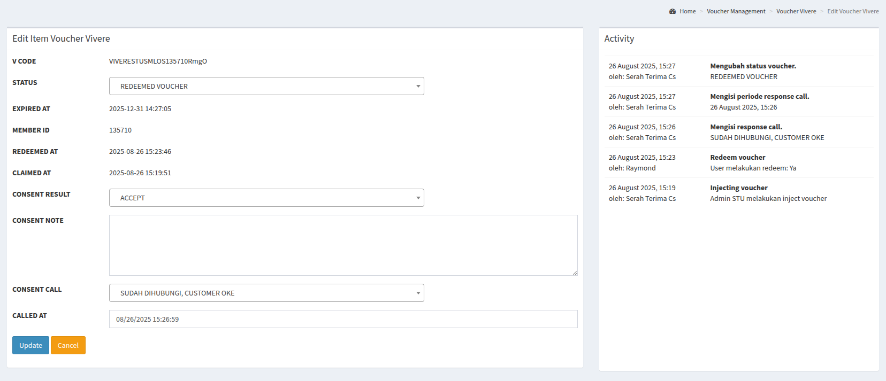

# User Journey e-Voucher Serah Terima Unit

Secara singkat, berikut adalah langkah-langkah untuk menerapkan e-voucher dalam agenda Serah Terima Unit (STU):

1. Menyiapkan konten e-voucher dan menyerahkan ke tim OneSmile.
1. Menerima kode master voucher untuk nanti dituliskan ke dalam file Excel.
1. Menyiapkan data penerima e-voucher melalui file Excel.
1. Mengunggah file Excel di halaman yang telah disediakan.
1. Memerhatikan dan menjalankan administrasi e-voucher dengan sebagaimana mestinya.

<!-- truncate -->

## Persiapan Partner

### Menyiapkan Konten e-Voucher

Berikut adalah yang harus disiapkan oleh _partner_ perihal konten e-voucher yang ingin diberikan:

- Deskripsi panjang e-voucher
- Deskripsi singkat e-voucher
- Syarat dan kondisi penggunaan e-voucher
- Gambar e-voucher

### Menerima Kode Master Voucher

Setelah _partner_ memberikan konten di atas, maka tim OneSmile akan memberikan kode unik yang akan digunakan dalam file Excel pada langkah berikutnya.

Kode unik berupa _string_ yang tidak terlalu pendek atau terlalu panjang, misalnya **_IDEMUSTUSML_**.

### Menyiapkan File Excel

Selanjutnya adalah _partner_ menuliskan penerima e-voucher dengan teliti. Berikut adalah gambaran data yang harus diisi.

| member_id     | v_code                      | no_hp                        | unique_code                |
| ------------- | --------------------------- | ---------------------------- | -------------------------- |
| _(kosongkan)_ | **kode unik dari OneSmile** | **nomor handphone customer** | **kode unik dari partner** |

Berikut adalah beberapa contohnya:

| member_id | v_code      | no_hp        | unique_code   |
| --------- | ----------- | ------------ | ------------- |
|           | IDEMUSTUSML | 081234567890 | AYOSEKOLAH001 |
|           | IDEMUSTUSML | 085612345678 | AYOSEKOLAH002 |

Berikut file Excel contoh yang bisa diunduh:

- [File Voucher Import](./voucher-import.xlsx)

### Menunggah File Excel

Setelah menuliskan penerima e-voucher, maka _partner_ dapat masuk ke **_[Panel OneSmile](https://panel.onesmile.digital)_** dengan username dan password yang telah diberikan, lalu masuk ke menu **_[Voucher Management - STU Voucher Inject](https://panel.onesmile.digital/admin/voucher-manage/merchant-stu-inject)_**.

_[Lihat gambar lebih besar](./002.png)_

Klik tombol **Inject Voucher**, lalu pilih file Excel yang telah disiapkan dan klik tombol **Import File**.

Jika tidak ada kesalahan, maka datanya akan muncul di bawahnya.

### Administrasi e-Voucher

Untuk tahap administrasi e-Voucher, tiap-tiap _partner_ telah diberikan _dedicated panel_ sehingga tidak tercampur satu sama lain, antara lain:

| Nama Partner | Halaman Panel                                                                       |
| ------------ | ----------------------------------------------------------------------------------- |
| Vivere       | [Panel Vivere](https://panel.onesmile.digital/admin/voucher-manage/merchant-vivere) |
| Crown        | [Panel Crown](https://panel.onesmile.digital/admin/voucher-manage/merchant-crown)   |
| Idemu        | [Panel Idemu](https://panel.onesmile.digital/admin/voucher-manage/merchant-idemu)   |
| _dst_        | _dst_                                                                               |

_[Lihat gambar lebih besar](./003.png)_

---

## Administrasi e-Voucher

### Penjelasan Antarmuka

Berikut adalah penjelasan mengenai antarmuka atau *interface* Panel Partner.

- **Empat Kotak Hijau Besar**

  Ada empat kotak, masing-masing bertuliskan secara berurutan, User Voucher, Waiting, In Process, dan Redeemed.

  - **User Voucher**, artinya e-voucher telah berhasil *di-inject* dan telah diterima oleh Customer.
  - **Waiting**, artinya Customer mengklaim e-voucher dan bersedia dihubungi oleh *partner*.
  - **In Process**, artinya *partner* telah menghubungi customer mengenai e-voucher yang ditawarkan.
  - **Redeemed**, artinya customer telah melakukan redeem terhadap e-voucher yang ditawarkan.

  Adapun angka yang ditampilkan mewakili jumlah customer untuk setiap status e-voucher tersebut.

- **Tabel Data**

  Berikut adalah penjelasan masing-masing kolomnya.

  - **Consent**, file consent perihal e-voucher.
  - **Voucher Code**, kode voucher.
  - **Fullname**, nama lengkap customer.
  - **Project**, nama project customer.
  - **Cluster**, nama cluster customer.
  - **Phone**, nomor handphone customer.
  - **Claimed At**, waktu di-*inject* oleh Admin STU.
  - **Last Response**, waktu terakhir customer bersenggolan dengan e-voucher.
  - **Expired At**, waktu *expired* e-voucher customer.
  - **Consent Result**, *consent* customer mengenai e-voucher.
  - **Status**, status voucher seperti di kotak-kotak hijau.

### Detail Data e-Voucher

*Partner* selanjutnya harus melakukan administrasi e-voucher sebagai salah satu metode *tracking* dan mempermudah urusan. Untuk melakukan hal ini, *partner* bisa mengklik tombol kuning kecil. Jika telah diklik, maka akan muncul seperti ini.

_[Lihat gambar lebih besar](./004.png)_

Halaman ini terbagi dua, kanan dan kiri. Kiri untuk detail voucher, dan kanan untuk menampilkan histori aktivitas *e-voucher*-nya.

### Ubah Data e-Voucher

Selanjutnya *partner* dapat mengubah beberapa data terkait masing-masing e-voucher, antara lain:

- **Consent Note**, catatan khusus mengenai probing terhadap customer.
- **Consent Call**, catatan perihal customer sudah atau belum dihubungi oleh *partner*.
- **Called At**, catatan perihal kapan customer dihubungi oleh *partner*.
- **Status**, ubah status menjadi **REDEEMED VOUCHER** jika dan hanya jika customer telah menerima manfaat dari e-voucher.

---

## Hubungi Tim OneSmile

Jika ada sesuatu, maka bisa menghubungi Christine Natalie.