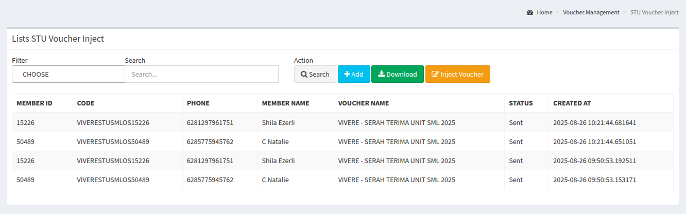
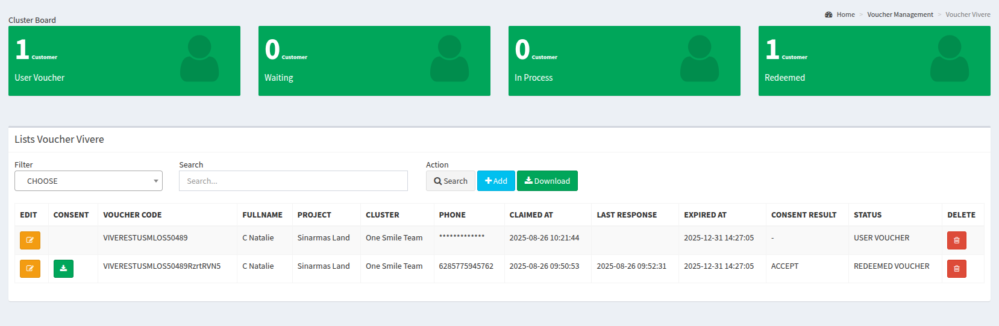

# User Journey e-Voucher Serah Terima Unit

Secara singkat, berikut adalah langkah-langkah untuk menerapkan e-voucher dalam agenda Serah Terima Unit (STU):

1. Menyiapkan konten e-voucher dan menyerahkan ke tim OneSmile.
1. Menerima kode master voucher untuk nanti dituliskan ke dalam file Excel.
1. Menyiapkan data penerima e-voucher melalui file Excel.
1. Mengunggah file Excel di halaman yang telah disediakan.
1. Memerhatikan dan menjalankan administrasi e-voucher dengan sebagaimana mestinya.

<!-- truncate -->

## Persiapan Partner

### Menyiapkan Konten e-Voucher

Berikut adalah yang harus disiapkan oleh _partner_ perihal konten e-voucher yang ingin diberikan:

- Deskripsi panjang e-voucher
- Deskripsi singkat e-voucher
- Syarat dan kondisi penggunaan e-voucher
- Gambar e-voucher

### Menerima Kode Master Voucher

Setelah _partner_ memberikan konten di atas, maka tim OneSmile akan memberikan kode unik yang akan digunakan dalam file Excel pada langkah berikutnya.

Kode unik berupa _string_ yang tidak terlalu pendek atau terlalu panjang, misalnya **_IDEMUSTUSML_**.

### Menyiapkan File Excel

Selanjutnya adalah _partner_ menuliskan penerima e-voucher dengan teliti. Berikut adalah gambaran data yang harus diisi.

| member_id     | v_code                      | no_hp                        | unique_code                |
| ------------- | --------------------------- | ---------------------------- | -------------------------- |
| _(kosongkan)_ | **kode unik dari OneSmile** | **nomor handphone customer** | **kode unik dari partner** |

Berikut adalah beberapa contohnya:

| member_id | v_code      | no_hp        | unique_code   |
| --------- | ----------- | ------------ | ------------- |
|           | IDEMUSTUSML | 081234567890 | AYOSEKOLAH001 |
|           | IDEMUSTUSML | 085612345678 | AYOSEKOLAH002 |

Berikut file Excel contoh yang bisa diunduh:

- [File Voucher Import](./voucher-import.xlsx)

### Menunggah File Excel

Setelah menuliskan penerima e-voucher, maka _partner_ dapat masuk ke **_[Panel OneSmile](https://panel.onesmile.digital)_** dengan username dan password yang telah diberikan, lalu masuk ke menu **_[Voucher Management - STU Voucher Inject](https://panel.onesmile.digital/admin/voucher-manage/merchant-stu-inject)_**.

*[Lihat gambar lebih besar](./002.png)*

Klik tombol **Inject Voucher**, lalu pilih file Excel yang telah disiapkan dan klik tombol **Import File**.

Jika tidak ada kesalahan, maka datanya akan muncul di bawahnya.

### Administrasi e-Voucher

Untuk tahap administrasi e-Voucher, tiap-tiap _partner_ telah diberikan _dedicated panel_ sehingga tidak tercampur satu sama lain, antara lain:

| Nama Partner | Halaman Panel                                                                       |
| ------------ | ----------------------------------------------------------------------------------- |
| Vivere       | [Panel Vivere](https://panel.onesmile.digital/admin/voucher-manage/merchant-vivere) |
| Crown        | [Panel Crown](https://panel.onesmile.digital/admin/voucher-manage/merchant-crown)   |
| Idemu        | [Panel Vivere](https://panel.onesmile.digital/admin/voucher-manage/merchant-idemu)  |
| _dst_        | _dst_                                                                               |

*[Lihat gambar lebih besar](./003.png)*