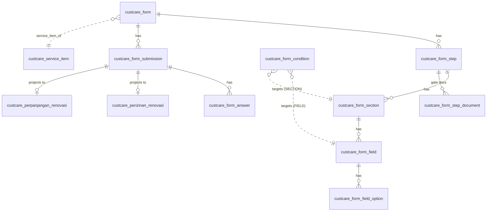

# Data Model

:::tip[Penyusun]

- Bazrira Noerfirdiansyah :: Fullstack Developer Senior Associate - Operational Technology

:::

This page is a single-stop reference for every database table introduced by the perizinan
revamp. The **catalog** tables (`custcare_service*`, `custcare_validation_rule`) are
documented on the [Service Catalog](./service-catalog.md) page; the `terms_and_conditions`
table is on the [Eligibility & T&C](./eligibility-and-tnc.md) page. This page focuses on the
**form-wizard** tables plus the `member` column addition and the projection target.

All `custcare_*` models use `freezeTableName: true` and `underscored: true`. `status = 1`
means active. Models live under `models/custcare/`.

:::note Migrations
Schema and seed data are numbered SQL files under `migrations/sql/` (currently through
`028_link_forms_to_service_item.sql`), applied in order; `fresh_install.sql` is the
consolidated baseline for a fresh DB. There is no migration runner — they are applied manually.
:::

## Entity relationships


```mermaid
erDiagram
    custcare_form ||--o{ custcare_form_step : has
    custcare_form_step ||--o{ custcare_form_section : has
    custcare_form_step ||--o{ custcare_form_step_document : "gate docs"
    custcare_form_section ||--o{ custcare_form_field : has
    custcare_form_field ||--o{ custcare_form_field_option : has
    custcare_form ||--o{ custcare_form_submission : has
    custcare_form_submission ||--o{ custcare_form_answer : has
    custcare_form_submission ||--o| custcare_perizinan_renovasi : "projects to"
    custcare_form_submission ||--o| custcare_perpanjangan_renovasi : "projects to"
    custcare_form_condition }o..|| custcare_form_field : "targets (FIELD)"
    custcare_form_condition }o..|| custcare_form_section : "targets (SECTION)"
    custcare_form }o..|| custcare_service_item : "service_item_id"
```

`custcare_form_condition` is polymorphic: a row targets either a field or a section via
`(target_type, target_id)` — there is no FK constraint, so the relationships above are logical.
`custcare_form.service_item_id` links a form to its catalog item (migration 028), the FK
`resolveFormByCode` follows to map a catalog `items[].code` to its form.

## Form structure tables

### `custcare_form`

| Column | Type | Notes |
| ------ | ---- | ----- |
| `id` | INTEGER | PK |
| `code` | STRING(64) | NOT NULL — the form's **internal, stable** code (e.g. `PENGAJUAN_IZIN_RENOVASI`, `PERPANJANGAN_RENOVASI`). `form/start` accepts the catalog `items[].code` and resolves via `service_item_id` first, falling back to this. |
| `name` | STRING(128) | NOT NULL |
| `description` | TEXT | |
| `service_item_id` | INTEGER | FK to the catalog item; `resolveFormByCode` follows it to map a catalog `items[].code` to its form (migration 028) |
| `legacy_service_code` | STRING(64) | bridges to the legacy formulir/PDF pipeline; also the default gate-doc `generator_key` |
| `projection_table` | STRING(64) | names the typed projection model (`custcare_perizinan_renovasi` or `custcare_perpanjangan_renovasi`) |
| `status` | SMALLINT | default `1` |

Finder: `findByCode(code)` (status 1). Form-code resolution: `resolveFormByCode(code)`.

### `custcare_form_step`

| Column | Type | Notes |
| ------ | ---- | ----- |
| `id` | INTEGER | PK |
| `form_id` | INTEGER | NOT NULL → form |
| `code` | STRING(64) | NOT NULL |
| `title` | STRING(128) | NOT NULL |
| `step_type` | STRING(24) | default `FORM`; `DOWNLOAD_GATE` triggers document generation |
| `display_mode` | STRING(16) | default `PAGE` — client rendering hint |
| `sort_order` | INTEGER | default `0` |
| `status` | SMALLINT | default `1` |

Finder: `findByForm(formId)` ordered by `sort_order`.

### `custcare_form_step_document`

DB-driven descriptors for the documents a `DOWNLOAD_GATE` step exposes (migration 016/017).
Replaces the previously hardcoded gate-document list; see
[DOWNLOAD_GATE steps](./form-wizard.md#download_gate-steps).

| Column | Type | Notes |
| ------ | ---- | ----- |
| `id` | INTEGER | PK |
| `step_id` | INTEGER | NOT NULL → step |
| `code` | STRING(64) | NOT NULL — document code (e.g. `formulir_renovasi`); referenced by the signed token |
| `label` | STRING(256) | NOT NULL — display label |
| `source_type` | STRING(16) | default `STATIC` — `STATIC` (served from `${ASSETS_URL}/{file_path}`) or `GENERATED` (rendered on demand) |
| `file_path` | STRING(512) | asset path for `STATIC` docs |
| `generator_key` | STRING(64) | template selector for `GENERATED` docs (e.g. `renovasi`, `surat-pemberitahuan`) |
| `sort_order` | INTEGER | default `0` |
| `status` | SMALLINT | default `1` |

Finder: `findByStep(stepId)` ordered by `sort_order`.

### `custcare_form_section`

| Column | Type | Notes |
| ------ | ---- | ----- |
| `id` | INTEGER | PK |
| `step_id` | INTEGER | NOT NULL → step |
| `code` | STRING(64) | NOT NULL |
| `title` | STRING(128) | |
| `sort_order` | INTEGER | default `0` |
| `status` | SMALLINT | default `1` |

Finder: `findByStep(stepId)` ordered by `sort_order`.

### `custcare_form_field`

| Column | Type | Notes |
| ------ | ---- | ----- |
| `id` | INTEGER | PK |
| `section_id` | INTEGER | NOT NULL → section |
| `code` | STRING(64) | NOT NULL — answer key |
| `label` | STRING(256) | |
| `placeholder` | STRING(256) | |
| `field_type` | STRING(24) | NOT NULL — see field types below |
| `required` | BOOLEAN | default `false` — base required (can be raised by conditions) |
| `repeatable` | BOOLEAN | default `false` |
| `readonly` | BOOLEAN | default `false` — server-authoritative value |
| `parent_field_id` | INTEGER | parent for nested / repeatable groups |
| `validation` | JSONB | default `{}` — passed through to the client |
| `default_value` | JSONB | fallback value when no prefill / answer |
| `prefill_source` | STRING(64) | dot-path or `resolver:KEY` ([prefill DSL](./form-wizard.md#prefill-dsl)) |
| `target_column` | STRING(64) | projection column mapping |
| `sort_order` | INTEGER | default `0` |
| `status` | SMALLINT | default `1` |

Finder: `findBySection(sectionId)` ordered by `sort_order`.

`field_type` ∈ `TEXT`, `TEXTAREA`, `NUMBER`, `SELECT`, `RADIO`, `CHECKBOX`, `CHECKBOX_GROUP`,
`DATE`, `DATE_RANGE`, `SIGNATURE`, `FILE`, `FILE_MULTI`, `BANK_SELECT`, `REPEATABLE_GROUP`
(`CHECKBOX` is a single boolean agreement, added with migration 018).

For `DATE` / `DATE_RANGE` fields, the `validation` JSONB carries the date-window config under
`validation.date` / `validation.date_range` (relative/absolute bounds, cross-field bounds, blackout
dates, duration limits, overlap guard, message overrides). The server resolves and enforces it
authoritatively — see [Date fields validation](./form-wizard.md#date-fields-validation-date--date_range).

### `custcare_form_field_option`

| Column | Type | Notes |
| ------ | ---- | ----- |
| `id` | INTEGER | PK |
| `field_id` | INTEGER | NOT NULL → field |
| `code` | STRING(64) | NOT NULL |
| `label` | STRING(256) | NOT NULL |
| `value` | STRING(128) | NOT NULL |
| `sort_order` | INTEGER | default `0` |
| `status` | SMALLINT | default `1` |

Finder: `findByFields(fieldIds)` → options grouped by `field_id`.

### `custcare_form_condition`

Polymorphic visibility / required rules. See the [condition DSL](./form-wizard.md#conditional-visibility--required-dsl).

| Column | Type | Notes |
| ------ | ---- | ----- |
| `id` | INTEGER | PK |
| `target_type` | STRING(16) | NOT NULL — `FIELD` or `SECTION` |
| `target_id` | INTEGER | NOT NULL — id of the targeted field/section |
| `source_field_code` | STRING(64) | NOT NULL — driving field's `code` |
| `operator` | STRING(16) | NOT NULL — `EQUALS` / `NOT_EQUALS` / `IN` / `INCLUDES` / `IS_TRUE` |
| `value` | JSONB | default `{}` — compared against the source answer |
| `action` | STRING(8) | default `SHOW`; also `REQUIRE` |
| `status` | SMALLINT | default `1` |

Finder: `findByTargets(targetType, targetIds)` → conditions grouped by `target_id`.

## Submission / answer tables

### `custcare_form_submission`

| Column | Type | Notes |
| ------ | ---- | ----- |
| `id` | INTEGER | PK |
| `form_id` | INTEGER | NOT NULL → form |
| `code` | STRING(64) | NOT NULL — `PRZ-{ts}-{rand}` |
| `member_id` | INTEGER | NOT NULL — owner of the draft |
| `parent_member_id` | INTEGER | on-behalf owner (contractor flow) |
| `status` | STRING(16) | default `DRAFT`; → `SUBMITTED` on final submit |
| `current_step_id` | INTEGER | wizard cursor |
| `meta` | JSONB | default `{}` |
| `final_payload` | JSONB | frozen denormalized snapshot at submit time |
| `submitted_at` | DATE | |

Finders: `findActiveDraft(memberId, formId)` (latest DRAFT), `findByCode(code)`.

### `custcare_form_answer`

| Column | Type | Notes |
| ------ | ---- | ----- |
| `id` | INTEGER | PK |
| `submission_id` | INTEGER | NOT NULL → submission |
| `field_id` | INTEGER | NOT NULL → field |
| `field_code` | STRING(64) | NOT NULL — denormalized for easy mapping |
| `value` | JSONB | scalar, array, or `{url, filename}` (file fields, after upload at `form/submit`). File fields are not written during the wizard; a legacy `{pending:true}` placeholder may exist for older clients but is optional |
| `idx` | INTEGER | default `0` — index for repeatable / multi-value answers |

Finder: `findBySubmission(submissionId)` ordered by `field_id`, `idx`.

## Projection target tables

`form/submit` projects a finished submission into a **typed table** named by
`custcare_form.projection_table` (see [Projection](./form-wizard.md#projection)).
`field.target_column` maps each answer to one of these columns; file answers are flattened to
their `url`. Two tables are registered in the projection `MODEL_REGISTRY`.

### `custcare_perizinan_renovasi`

The target for the renovasi permit form (`PENGAJUAN_IZIN_RENOVASI`).

| Column | Type | Notes |
| ------ | ---- | ----- |
| `id` | INTEGER | PK |
| `submission_id` | INTEGER | NOT NULL — upsert conflict key |
| `submission_code` | STRING(64) | NOT NULL |
| `member_id` | INTEGER | NOT NULL |
| `parent_member_id` | INTEGER | |
| `status` | STRING(16) | default `SUBMITTED` |
| `submitted_at` | DATE | |
| `saya_selaku` | STRING(64) | applicant role (`SAYA_SELAKU` resolver) |
| `nama_anda` | TEXT | |
| `no_hp_anda` | TEXT | |
| `surat_kuasa_url` | TEXT | power-of-attorney document |
| `nama_lengkap` | TEXT | |
| `no_handphone` | TEXT | |
| `email` | TEXT | |
| `cluster` | TEXT | |
| `tipe_unit` | STRING(64) | |
| `jenis_usaha` | TEXT | |
| `peruntukan_bangunan` | TEXT | |
| `periode` | TEXT | |
| `tanda_tangan_url` | TEXT | signature |
| `lingkup_pekerjaan` | JSONB | scope of work (multi-select) |
| `lantai_ke` | TEXT | |
| `pekerjaan_lainnya` | JSONB | |
| `formulir_renovasi_url` | TEXT | generated formulir |
| `surat_pemberitahuan_url` | TEXT | notice letter |
| `ktp_url` | TEXT | ID card |
| `denah_eksisting_url` | TEXT | existing floor plan |
| `bukti_kepemilikan` | JSONB | ownership proof (multi-file) |
| `gambar_rencana` | JSONB | plan drawings (multi-file) |
| `foto_tampak_depan` | JSONB | front-elevation photos (multi-file) |
| `bank_tujuan` | STRING(64) | destination bank code |
| `no_rekening` | TEXT | account number |

### `custcare_perpanjangan_renovasi`

The target for the perpanjangan (extension) form, prefilled via
[carryover](./form-wizard.md#perpanjangan-carryover) from the member's prior renovasi
submission. Model: `models/custcare/ccPerpanjanganRenovasi.model.js` (migration 016/017).

| Column | Type | Notes |
| ------ | ---- | ----- |
| `id` | INTEGER | PK |
| `submission_id` | INTEGER | NOT NULL — upsert conflict key |
| `submission_code` | STRING(64) | NOT NULL |
| `member_id` | INTEGER | NOT NULL |
| `parent_member_id` | INTEGER | |
| `status` | STRING(16) | default `SUBMITTED` |
| `submitted_at` | DATE | |
| `saya_selaku` | STRING(64) | applicant role |
| `nama_anda` | TEXT | |
| `no_hp_anda` | TEXT | |
| `peran_anda` | TEXT | |
| `nama_lengkap` | TEXT | |
| `no_handphone` | TEXT | |
| `email` | TEXT | |
| `cluster` | TEXT | |
| `tipe_unit` | STRING(64) | |
| `jenis_usaha` | TEXT | |
| `peruntukan_bangunan` | TEXT | |
| `periode` | TEXT | |
| `lingkup_pekerjaan` | JSONB | scope of work (carried over, mapped to label rows) |
| `tanda_tangan_url` | TEXT | signature |

## `member.member_attribute` (added column)

Commit `1bdf109` added a single column to the existing `member` model, consumed by the
`SAYA_SELAKU` prefill resolver:

```js
member_attribute: {
    type: DataTypes.STRING,
},
```

Values are interpreted case-insensitively: `Pemilik` → `PEMILIK`, `Penyewa` → `PENYEWA`,
anything else → `KUASA_PEMILIK_LAINNYA` (a member can never be a `Kontraktor` via this
attribute — that role comes only from an active `member_contractor` row).
