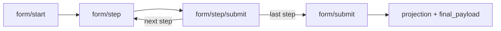

# Form Wizard Engine

:::tip[Penyusun]

- Bazrira Noerfirdiansyah :: Fullstack Developer Senior Associate - Operational Technology

:::

The form wizard is a **server-driven** engine: the form structure (steps, sections, fields,
options, conditions) lives entirely in the `custcare_form_*` tables, and a member's progress
lives in `custcare_form_submission` + `custcare_form_answer`. The client renders whatever the
server returns and never hard-codes the form layout or validation.

Source: `services/v1/customer_care/cc_form_engine.service.js` (engine),
`cc_form_condition.evaluator.js` (visibility/required DSL),
`cc_form_prefill.resolver.js` (prefill DSL), `cc_form_projection.service.js` (typed projection).
Wiring: `controllers/v1/customer_care/cc_form.controller.js`.

## Lifecycle



- `form/start` creates (or resumes) a **DRAFT** submission and returns the current step.
- `form/step` / `form/step/submit` walk the wizard, persisting answers per step.
- `form/submit` does a full re-validation, uploads the held files, freezes a snapshot, and
  projects to the typed table.

Each member has **at most one active draft per form** — `start` reuses it via
`CustcareFormSubmission.findActiveDraft(member_id, form_id)`. New submissions get a code of
the shape `PRZ-{timestamp}-{random}` (`generateSubmissionCode()`).

All endpoints require `x-auth-token`, resolve the member, and verify the submission belongs
to that member before doing anything.

## Endpoints

### `POST /document-request/form/start`

Begin (or resume) a form.

Request:

| Field | Required | Notes |
| ----- | -------- | ----- |
| `form_code` | yes | e.g. `RENOVASI`. Missing → `form_code diperlukan`. |
| `parent_member_id` | no | Owner the form is filed on behalf of (contractor flow). Stored on the submission and exposed to prefill as `owner`. |

Returns the assembled current step (see [Step response shape](#step-response-shape)).

### `POST /document-request/form/step`

Read a step without mutating. Request: `{ submission_id, step_id? }`. When `step_id` is
omitted, the submission's `current_step_id` is used. Returns the same step shape.

### `POST /document-request/form/step/submit`

Persist a step's answers and advance.

Request:

```json
{
  "submission_id": 555,
  "step_id": 12,
  "answers": [
    { "code": "nama_lengkap", "value": "Budi" },
    { "code": "lingkup_pekerjaan", "value": ["PERLUASAN", "CARPORT"] },
    { "code": "foto", "value": { "pending": true }, "idx": 0 }
  ]
}
```

Behavior:

- **Readonly fields are server-authoritative**: client values for readonly fields are
  discarded and replaced with server-derived values (see [Prefill](#prefill-dsl)).
- Validates **visible + required** fields for this step only. A required, visible, empty
  field returns `{ success: false, msg: 'Validasi gagal', data: { errors: [...] } }`.
- Persists answers inside a transaction: it deletes this step's existing answer rows, then
  bulk-inserts the submitted (non-readonly) answers plus the server-derived readonly rows.
- Advances `current_step_id` to the next step (or stays on the last step).

Response when there **is** a next step → the assembled next step. When it was the **last**
step:

```json
{ "success": true, "msg": "OK", "data": { "completed": true, "submission_id": 555, "can_submit": true } }
```

### `POST /document-request/form/upload` (legacy)

Eager per-field upload: `{ submission_id, field_code, file (base64), filename? }` →
`{ url, filename }`. **Deprecated** — the current flow defers all uploads to `form/submit`.
Kept only for older clients.

### `POST /document-request/form/submit`

Finalize the submission.

Request:

```json
{
  "submission_id": 555,
  "files": [
    { "field_code": "ktp", "file": "<base64>", "filename": "ktp.jpg", "idx": 0 },
    { "field_code": "foto_tampak_depan", "file": "<base64>", "filename": "depan.jpg", "idx": 0 }
  ]
}
```

Behavior (in order):

1. Re-validate **all** steps. File fields still holding a `{ pending: true }` placeholder
   count as "present" at this stage.
2. **Deferred upload**: each entry in `files` is uploaded to Azure blob storage at
   `cc-form/{submission_code}/{field_code}-{timestamp}.{ext}` (content-type inferred from the
   extension). The resulting `{ url, filename }` replaces the placeholder rows in one
   transaction (all rows for an uploaded field are deleted and re-created, so `FILE_MULTI`
   stays one row per `idx`). An unknown or non-file `field_code` → `Field file tidak dikenal`.
3. **Guard**: if any visible + required file field is still on a placeholder after upload →
   `{ success: false, msg: 'Berkas belum lengkap', data: { errors: [...] } }`.
4. **PDF bridge** (best-effort): calls `createFormulirRenovasiBeforeSave(...)` to generate the
   surat kepatuhan; its blob path is stored as `documents.surat_kepatuhan`. Failures are logged
   and do not block submission.
5. Freeze a denormalized snapshot into `submission.final_payload`, set
   `status = 'SUBMITTED'` and `submitted_at`.
6. **Projection** (best-effort): `projectSubmission(...)` upserts a typed row (see
   [Projection](#projection)). Failures are logged and do not block — `final_payload` is the
   durable source of truth.

Response:

```json
{
  "success": true,
  "msg": "OK",
  "data": {
    "submission_id": 555,
    "submission_code": "PRZ-1719280000000-AB3KX",
    "status": "SUBMITTED",
    "form_code": "RENOVASI",
    "documents": { "surat_kepatuhan": "https://.../..." },
    "projection_id": 42
  }
}
```

### `POST /document-request/form/my-submissions`

Lists the caller's submissions, newest first.

```json
{
  "success": true,
  "msg": "OK",
  "data": [
    {
      "submission_id": 555,
      "submission_code": "PRZ-...",
      "form_id": 3,
      "status": "SUBMITTED",
      "current_step_id": 12,
      "submitted_at": "2026-06-25T...",
      "created_at": "2026-06-25T..."
    }
  ]
}
```

## Step response shape

`form/start`, `form/step`, and a non-final `form/step/submit` all return the same assembled
step (`assembleStep`):

```json
{
  "submission_id": 555,
  "submission_code": "PRZ-...",
  "submission_status": "DRAFT",
  "step": {
    "id": 12, "code": "DATA_DIRI", "title": "Data Diri",
    "step_type": "FORM", "display_mode": "PAGE", "sort_order": 1
  },
  "sections": [
    {
      "id": 30, "code": "IDENTITAS", "title": "Identitas", "sort_order": 0,
      "visible": true,
      "fields": [
        {
          "id": 300, "code": "nama_lengkap", "label": "Nama Lengkap",
          "placeholder": "...", "field_type": "TEXT",
          "required": true, "repeatable": false, "readonly": false,
          "parent_field_code": null,
          "options": [],
          "validation": {},
          "value": "Budi",
          "visible": true,
          "conditions": [
            { "source_field_code": "saya_selaku", "operator": "EQUALS", "value": "KONTRAKTOR", "action": "SHOW" }
          ]
        }
      ]
    }
  ],
  "navigation": {
    "is_first": false, "is_last": false,
    "prev_step_id": 11, "next_step_id": 13, "total_steps": 5
  },
  "documents": []
}
```

- `value` is the **effective** value: the saved answer if one exists, otherwise the resolved
  prefill / default value.
- `visible` (per field and per section) is evaluated **server-side** against the effective
  answer map — this is authoritative.
- `conditions` are also returned per field so the client can reactively reveal within-step
  fields as the user types, without a round-trip.
- `documents` is only present for `DOWNLOAD_GATE` steps (see [below](#download_gate-steps)).

## Conditional visibility / required DSL

Source: `cc_form_condition.evaluator.js`. A condition is
`{ source_field_code, operator, value, action }`.

### Operators

| Operator | True when |
| -------- | --------- |
| `EQUALS` | `answer === value` |
| `NOT_EQUALS` | `answer !== value` |
| `IN` | `value` is an array and includes `answer` |
| `INCLUDES` | `answer` is an array and includes `value` |
| `IS_TRUE` | `answer` is `true`, `'true'`, or `1` |

An **unknown operator returns `true`** (does not hide / does not force-require).

### Visibility (`isVisible`)

Looks only at conditions with `action === 'SHOW'`:

- No `SHOW` conditions → **visible** (default true).
- One or more `SHOW` conditions → visible only if **all** of them pass (AND logic).

### Required (`isRequired`)

- If the field's base `required` is `true` → always required.
- Otherwise, required if **any** `REQUIRE`-action condition passes (OR logic).

## Prefill DSL

Source: `cc_form_prefill.resolver.js`. `prefill_source` on a field is either a **dot-path**
against the context `{ member, owner }` or a **resolver key**.

| `prefill_source` | Resolves to |
| ---------------- | ----------- |
| `member.member_nm` | `ctx.member.member_nm` (safe dot-path, no eval) |
| `owner.member_phone` | `ctx.owner.member_phone` (owner = `parent_member_id`'s member) |
| `resolver:SAYA_SELAKU` | runs the `SAYA_SELAKU` resolver function |

Prefill output is read-only display data and is only used when there is **no saved answer**
for the field. For readonly fields it is also what gets persisted.

### `SAYA_SELAKU` resolver

Derives the applicant role:

1. If an active `member_contractor` row exists (`member_id`, `status = 1`) → `KONTRAKTOR`
   (the only way to become a contractor).
2. Otherwise map `member.member_attribute` (trimmed, lower-cased):
   - `pemilik` → `PEMILIK`
   - `penyewa` → `PENYEWA`
   - anything else → `KUASA_PEMILIK_LAINNYA`

The `member_attribute` column was added to the `member` model in commit `1bdf109`.

## Field types & special handling

`field_type` values the engine knows about: `TEXT`, `TEXTAREA`, `NUMBER`, `SELECT`, `RADIO`,
`CHECKBOX_GROUP`, `DATE`, `SIGNATURE`, `FILE`, `FILE_MULTI`, `BANK_SELECT`, `REPEATABLE_GROUP`.

- **File fields** (`FILE`, `FILE_MULTI`, `SIGNATURE`) hold a `{ pending: true }` placeholder
  during the wizard; the bytes are uploaded only at `form/submit`.
- **`BANK_SELECT`** falls back to a built-in `BANK_OPTIONS` list (BCA, BNI, BRI, Mandiri,
  CIMB, Permata) when the field has no DB options — it can be promoted to a DB-backed resolver
  later without changing the contract.
- **Answer storage**: a single row at `idx = 0` is read back as a scalar; multiple rows
  (e.g. `FILE_MULTI`, repeatable groups) are read back as an array ordered by `idx`
  (`buildAnswersMap`).

### `DOWNLOAD_GATE` steps

When `step.step_type === 'DOWNLOAD_GATE'`, the step response includes a `documents` array
(`resolveGateDocuments`, best-effort):

- `formulir_renovasi` — generated via `createFormulirRenovasiBeforeSave` using the form's
  `legacy_service_code`.
- `surat_pemberitahuan` — a static template at `${ASSETS_URL}/doc/cc/surat-pemberitahuan-renovasi.pdf`.

Each entry is `{ code, label, url, filename }`.

## Projection

Source: `cc_form_projection.service.js`. After a successful `form/submit`, the engine projects
the answers into a **typed table** so downstream systems (e.g. SAP CX) can consume structured
columns instead of JSONB.

- The target model is looked up in `MODEL_REGISTRY` by `form.projection_table`. Currently only
  `custcare_perizinan_renovasi` is registered; an unregistered table → projection is skipped
  (returns `null`).
- Each field with a `target_column` maps its answer into that column. `extractValue` pulls the
  `.url` from `FILE`/`SIGNATURE` objects and from each element of `FILE_MULTI` arrays; other
  types (e.g. `CHECKBOX_GROUP`) are stored as-is (JSONB).
- The row is written with `Model.upsert(..., { conflictFields: ['submission_id'] })`, so
  re-submitting the same submission updates rather than duplicates.

See the [Data Model](./data-model.md#custcare_perizinan_renovasi-projection-target) page for
the projection table's columns.
