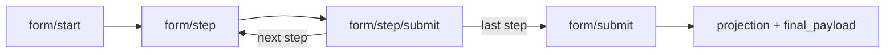

# Form Wizard Engine

:::tip[Penyusun]

- Bazrira Noerfirdiansyah :: Fullstack Developer Senior Associate - Operational Technology

:::

The form wizard is a **server-driven** engine: the form structure (steps, sections, fields,
options, conditions) lives entirely in the `custcare_form_*` tables, and a member's progress
lives in `custcare_form_submission` + `custcare_form_answer`. The client renders whatever the
server returns and never hard-codes the form layout or validation.

Source: `services/v1/customer_care/cc_form_engine.service.js` (engine),
`cc_form_condition.evaluator.js` (visibility/required DSL),
`cc_form_prefill.resolver.js` (prefill DSL), `cc_form_projection.service.js` (typed projection).
Wiring: `controllers/v1/customer_care/cc_form.controller.js`.

## Lifecycle


```mermaid
flowchart LR
    S[form/start] --> T[form/step]
    T --> U[form/step/submit]
    U -->|next step| T
    U -->|last step| V[form/submit]
    V --> P[projection + final_payload]
```

- `form/start` creates (or resumes) a **DRAFT** submission and returns the current step.
- `form/step` / `form/step/submit` walk the wizard, persisting answers per step.
- `form/submit` does a full re-validation, uploads the held files, freezes a snapshot, and
  projects to the typed table.

Each member has **at most one active draft per form** — `start` reuses it via
`CustcareFormSubmission.findActiveDraft(member_id, form_id)`. New submissions get a code of
the shape `PRZ-{timestamp}-{random}` (`generateSubmissionCode()`).

All endpoints require `x-auth-token`, resolve the member, and verify the submission belongs
to that member before doing anything.

## Endpoints

### `POST /perizinan/form/start`

Begin (or resume) a form.

Request:

| Field | Required | Notes |
| ----- | -------- | ----- |
| `form_code` | yes | The **catalog item code** (`items[].code` from `/get-sub-service-grouped`), e.g. `PENGAJUAN_IZIN_RENOVASI` or `PERPANJANGAN_IZIN_RENOVASI`. Missing → `form_code diperlukan`. |
| `parent_member_id` | no | Owner the form is filed on behalf of (contractor flow). Stored on the submission and exposed to prefill as `owner`. |

`form_code` is resolved to a form via `resolveFormByCode`: it matches the code against active
`custcare_service_item` rows and follows `custcare_form.service_item_id` to the form (migration
028), falling back to `custcare_form.findByCode` for legacy/unlinked forms. Unknown code →
`Form tidak ditemukan`; a form with no steps → `Form belum memiliki step`.

Returns the assembled current step (see [Step response shape](#step-response-shape)).

### `POST /perizinan/form/step`

Read a step without mutating. Request: `{ submission_id, step_id? }`. When `step_id` is
omitted, the submission's `current_step_id` is used. Returns the same step shape.

### `POST /perizinan/form/step/submit`

Persist a step's answers and advance.

Request:

```json
{
  "submission_id": 555,
  "step_id": 12,
  "answers": [
    { "code": "nama_lengkap", "value": "Budi" },
    { "code": "lingkup_pekerjaan", "value": ["PERLUASAN", "CARPORT"] }
  ]
}
```

File fields (`FILE` / `SIGNATURE` / `FILE_MULTI`) are **omitted here** — they are not part of
per-step validation, so a step containing file fields advances without them. Keep the selected
bytes on the client and send them all in `form/submit`'s `files[]`; required file fields are
enforced only there. (Each file field still carries `required: true` in the step envelope, so the
client can gate its own UI — the server just won't reject at step submit.)

Behavior:

- **Readonly fields are server-authoritative**: client values for readonly fields are
  discarded and replaced with server-derived values (see [Prefill](#prefill-dsl)).
- Validates **visible + required** fields for this step only. A required, visible, empty
  field returns `{ success: false, msg: 'Validasi gagal', data: { errors: [...] } }`.
- Persists answers inside a transaction: it deletes this step's existing answer rows, then
  bulk-inserts the submitted (non-readonly) answers plus the server-derived readonly rows.
- Advances `current_step_id` to the next step (or stays on the last step).

Response when there **is** a next step → the assembled next step. When it was the **last**
step:

```json
{ "success": true, "msg": "OK", "data": { "completed": true, "submission_id": 555, "can_submit": true } }
```

### `POST /perizinan/form/upload` (legacy)

Eager per-field upload: `{ submission_id, field_code, file (base64), filename? }` →
`{ url, filename }`. **Deprecated** — the current flow defers all uploads to `form/submit`.
Kept only for older clients.

### `POST /perizinan/form/submit`

Finalize the submission.

Request:

```json
{
  "submission_id": 555,
  "files": [
    { "field_code": "ktp", "file": "<base64>", "filename": "ktp.jpg", "idx": 0 },
    { "field_code": "foto_tampak_depan", "file": "<base64>", "filename": "depan.jpg", "idx": 0 }
  ]
}
```

Behavior (in order):

1. Re-validate **all** steps for non-file fields (file fields are validated in step 3, after
   upload — they are never validated during the wizard). Note this is a **single** request
   carrying every file as base64 against the 100 MB body limit — an accepted tradeoff of
   deferring all uploads to submit time.
2. **Deferred upload**: each entry in `files` is uploaded to Azure blob storage at
   `cc-form/{submission_code}/{field_code}-{timestamp}.{ext}` (content-type inferred from the
   extension). The resulting `{ url, filename }` replaces the placeholder rows in one
   transaction (all rows for an uploaded field are deleted and re-created, so `FILE_MULTI`
   stays one row per `idx`). An unknown or non-file `field_code` → `Field file tidak dikenal`.
3. **File-required guard** (the single authority for file requiredness): if any visible + required
   file field is missing after upload — never sent, or an older client left it on a `{ pending }`
   placeholder whose bytes never arrived → `{ success: false, msg: 'Berkas belum lengkap', data: { errors: [...] } }`.
4. **PDF bridge** (best-effort): calls `createFormulirRenovasiBeforeSave(...)` to generate the
   surat kepatuhan; its blob path is stored as `documents.surat_kepatuhan`. Failures are logged
   and do not block submission.
5. Freeze a denormalized snapshot into `submission.final_payload`, set
   `status = 'SUBMITTED'` and `submitted_at`.
6. **Projection** (best-effort): `projectSubmission(...)` upserts a typed row (see
   [Projection](#projection)). Failures are logged and do not block — `final_payload` is the
   durable source of truth.

Response:

```json
{
  "success": true,
  "msg": "OK",
  "data": {
    "submission_id": 555,
    "submission_code": "PRZ-1719280000000-AB3KX",
    "status": "SUBMITTED",
    "form_code": "PENGAJUAN_IZIN_RENOVASI",
    "documents": { "surat_kepatuhan": "https://.../..." },
    "projection_id": 42
  }
}
```

### `POST /perizinan/form/my-submissions`

Lists the caller's submissions, newest first.

```json
{
  "success": true,
  "msg": "OK",
  "data": [
    {
      "submission_id": 555,
      "submission_code": "PRZ-...",
      "form_id": 3,
      "status": "SUBMITTED",
      "current_step_id": 12,
      "submitted_at": "2026-06-25T...",
      "created_at": "2026-06-25T..."
    }
  ]
}
```

### `POST /perizinan/form/detail`

Read-only view of a single submission — header + labeled field sections + downloadable documents.
This is the perizinan **detail** endpoint the [My Tickets](./tickets.md) list routes to when a card's
`source` is `perizinan`. Controller: `FormDetail`; source: `submissionDetail` in
`cc_form_engine.service.js`.

Request — **either** identifier (at least one is required; missing both → `submission_id diperlukan`):

```json
{ "submission_id": 9 }
```
```json
{ "submission_code": "PRZ-1719280000000-AB3KX" }
```

Behavior:

- **Ownership**: the submission must belong to the caller (`member_id` from `x-auth-token`); a
  mismatch (or unknown id) returns `{ success: false, msg: 'Submission tidak ditemukan' }`.
- **Answer source**: a `SUBMITTED` submission renders from its frozen `final_payload.answers`; a
  `DRAFT` falls back to the live answer rows.
- **Visible only**: only currently-visible sections/fields are returned — conditional fields that
  don't apply, and resolver-only-hidden fields, are omitted (sections with no surviving fields drop).
  Unlike the wizard's `assembleStep`, detail fields **do not** carry `id`, `placeholder`, `required`,
  `validation`, or `conditions`.
- **Catalog labels**: `category_*` / `service_*` / `title` come from `resolveFormCatalog(form)`, which
  joins `form.service_item_id → item → group → service → category`. `title` is the form name;
  `service_name` falls back to the form name when the catalog join is empty.

Response:

```json
{
  "success": true,
  "msg": "OK",
  "data": {
    "ticket_id": 9,
    "source": "perizinan",
    "code": "PRZ-1719280000000-AB3KX",
    "category_code": "PERMINTAAN",
    "category_name": "Permintaan",
    "service_code": "IZIN_KERJA_RENOVASI",
    "service_name": "Izin Kerja / Renovasi",
    "title": "Pengajuan Renovasi",
    "status": "SUBMITTED",
    "status_label": "Sedang Diproses",
    "status_color": "#F97316",
    "submitted_at": "2026-06-25T05:30:00.000Z",
    "created_at": "2026-06-24T00:00:00.000Z",
    "sections": [
      {
        "code": "DATA_PEMILIK",
        "title": "Data Pemilik",
        "fields": [
          { "code": "nama_lengkap", "label": "Nama Lengkap", "field_type": "TEXT", "value": "Budi Santoso", "display_value": "Budi Santoso", "options": [] },
          { "code": "tipe_unit", "label": "Tipe Unit", "field_type": "SELECT", "value": "HUNIAN", "display_value": "Hunian", "options": [ { "code": "HUNIAN", "label": "Hunian", "value": "HUNIAN" } ] },
          { "code": "setuju_kepatuhan", "label": "Saya setuju…", "field_type": "CHECKBOX", "value": true, "display_value": "Ya", "options": [] }
        ]
      }
    ],
    "documents": [
      { "code": "formulir_renovasi", "label": "Formulir Renovasi", "url": "https://<node_url>/perizinan/public/form/document?token=<signed>" },
      { "code": "surat_kepatuhan", "label": "Surat Kepatuhan", "url": "https://<blob-host>/cc-form/.../surat-kepatuhan.pdf" }
    ]
  }
}
```

`documents[]` combines the form's `DOWNLOAD_GATE` docs (signed capability URLs, resolved the same way
as in the wizard) with any frozen compliance PDFs from `final_payload.documents` (labels from
`FROZEN_DOCUMENT_LABELS`, e.g. `surat_kepatuhan` → "Surat Kepatuhan").

#### `display_value` rendering (`formatFieldDisplay`)

The human-readable rendering of each field, per `field_type`:

| `field_type` | `display_value` |
| ------------ | --------------- |
| `SELECT` / `RADIO` / `BANK_SELECT` | the option's `label` (matched on `value` or `code`) |
| `CHECKBOX_GROUP` | option labels joined with `, ` |
| `CHECKBOX` | `Ya` when `value === true`, else `Tidak` |
| `DATE_RANGE` | `start s/d end` (when both present) |
| `FILE` / `SIGNATURE` | the file's `filename` |
| `FILE_MULTI` | filenames joined with `, ` |
| everything else (`TEXT`, `NUMBER`, `DATE`, …) | the raw value as a string (arrays joined with `, `) |

An empty value (`null` / `undefined` / `''`) renders as `null`. `status_label` / `status_color` come
from `statusLabelFor` (`SUBMITTED` → "Sedang Diproses" / `#F97316`; `DRAFT` → "Draft" / `#9CA3AF`).

### `GET /perizinan/public/form/document?token=…` (public)

Downloads a single **DOWNLOAD_GATE** document. This is the **only public endpoint** — it takes
**no** `x-auth-token`; the signed `token` query param (minted by the wizard in a step's
`documents[].url`) is the credential. Controller: `FormDocumentPublic`; source:
`getGateDocumentByToken` in `cc_form_engine.service.js`. See
[DOWNLOAD_GATE steps](#download_gate-steps) for how the token and document are produced.

The path contains `public`, so `app.js` auth middleware lets it through without a member token.

| Outcome | HTTP | Body |
| ------- | ---- | ---- |
| Generated PDF | `200` | The rendered PDF bytes, `Content-Type: application/pdf`, `Content-Disposition: attachment`. Nothing is persisted to blob storage. |
| Static asset | `302` | Redirect to the `${ASSETS_URL}/…` file. |
| Missing token | `400` | `{ success: false, msg: 'token diperlukan' }` |
| Bad / malformed token | `401` | `{ success: false, msg: 'Token tidak valid' }` |
| Expired token (> 24h) | `410` | `{ success: false, msg: 'Tautan telah kedaluwarsa' }` |
| Submission / member / doc not found | `404` | `{ success: false, msg: '…tidak ditemukan' }` |
| Generation failed | `500` | `{ success: false, msg: 'Dokumen tidak dapat dibuat' }` |

## Step response shape

`form/start`, `form/step`, and a non-final `form/step/submit` all return the same assembled
step (`assembleStep`):

```json
{
  "submission_id": 555,
  "submission_code": "PRZ-...",
  "submission_status": "DRAFT",
  "step": {
    "id": 12, "code": "DATA_DIRI", "title": "Data Diri",
    "step_type": "FORM", "display_mode": "PAGE", "sort_order": 1
  },
  "sections": [
    {
      "id": 30, "code": "IDENTITAS", "title": "Identitas", "sort_order": 0,
      "visible": true,
      "fields": [
        {
          "id": 300, "code": "nama_lengkap", "label": "Nama Lengkap",
          "placeholder": "...", "field_type": "TEXT",
          "required": true, "repeatable": false, "readonly": false,
          "parent_field_code": null,
          "options": [],
          "validation": {},
          "value": "Budi",
          "visible": true,
          "conditions": [
            { "source_field_code": "saya_selaku", "operator": "EQUALS", "value": "KONTRAKTOR", "action": "SHOW" }
          ]
        }
      ]
    }
  ],
  "navigation": {
    "is_first": false, "is_last": false,
    "prev_step_id": 11, "next_step_id": 13, "total_steps": 5
  },
  "documents": []
}
```

- `value` is the **effective** value: the saved answer if one exists, otherwise the resolved
  prefill / default value.
- `visible` (per field and per section) is evaluated **server-side** against the effective
  answer map — this is authoritative.
- `conditions` are also returned per field so the client can reactively reveal within-step
  fields as the user types, without a round-trip.
- `documents` is only present for `DOWNLOAD_GATE` steps (see [below](#download_gate-steps)).

## Conditional visibility / required DSL

Source: `cc_form_condition.evaluator.js`. A condition is
`{ source_field_code, operator, value, action }`.

### Operators

| Operator | True when |
| -------- | --------- |
| `EQUALS` | `answer === value` |
| `NOT_EQUALS` | `answer !== value` |
| `IN` | `value` is an array and includes `answer` |
| `INCLUDES` | `answer` is an array and includes `value` |
| `IS_TRUE` | `answer` is `true`, `'true'`, or `1` |

An **unknown operator returns `true`** (does not hide / does not force-require).

### Visibility (`isVisible`)

Looks only at conditions with `action === 'SHOW'`:

- No `SHOW` conditions → **visible** (default true).
- One or more `SHOW` conditions → visible only if **all** of them pass (AND logic).

### Required (`isRequired`)

- If the field's base `required` is `true` → always required.
- Otherwise, required if **any** `REQUIRE`-action condition passes (OR logic).

## Prefill DSL

Source: `cc_form_prefill.resolver.js`. `prefill_source` on a field is either a **dot-path**
against the context `{ member, owner, renovasi }` or a **resolver key**.

| `prefill_source` | Resolves to |
| ---------------- | ----------- |
| `member.member_nm` | `ctx.member.member_nm` (safe dot-path, no eval) |
| `owner.member_phone` | `ctx.owner.member_phone` (owner = the unit Pemilik, see below) |
| `renovasi.nama_lengkap` | `ctx.renovasi.nama_lengkap` — a value carried over from the member's prior renovasi submission (see [Perpanjangan carryover](#perpanjangan-carryover)) |
| `resolver:SAYA_SELAKU` | runs the `SAYA_SELAKU` resolver function |

Prefill output is read-only display data and is only used when there is **no saved answer**
for the field. For readonly fields it is also what gets persisted.

### `owner` — the unit Pemilik (`loadOwner`)

`ctx.owner` is resolved by `loadOwner(parent_member_id, member)` and fills the **Data Pemilik**
section: an explicit `parent_member_id` (on-behalf/contractor flow) wins; otherwise the owner is
the `PEMILIK` member sharing this member's `member_ipl` — which resolves to the member themselves
when they are the owner. Returns `null` if no owner is found (migration 024).

### `SAYA_SELAKU` resolver

Derives the applicant role:

1. If an active `member_contractor` row exists (`member_id`, `status = 1`) → `KONTRAKTOR`
   (the only way to become a contractor).
2. Otherwise map `member.member_attribute` (trimmed, lower-cased):
   - `pemilik` → `PEMILIK`
   - `penyewa` → `PENYEWA`
   - anything else → `KUASA_PEMILIK_LAINNYA`

The `member_attribute` column was added to the `member` model in commit `1bdf109`.

## Field types & special handling

`field_type` values the engine knows about: `TEXT`, `TEXTAREA`, `NUMBER`, `SELECT`, `RADIO`,
`CHECKBOX`, `CHECKBOX_GROUP`, `DATE`, `DATE_RANGE`, `SIGNATURE`, `FILE`, `FILE_MULTI`,
`BANK_SELECT`, `REPEATABLE_GROUP`.

- **`CHECKBOX`** is a single boolean agreement (distinct from the multi-select
  `CHECKBOX_GROUP`); when required it must be explicitly `true` — see
  [Engine hardening](#engine-hardening--server-authoritative-rules).

- **`DATE`** (ISO `YYYY-MM-DD`) and **`DATE_RANGE`** (`{ "start": "…", "end": "…" }`) carry their
  constraints in the field's `validation` JSONB (`validation.date` / `validation.date_range`). The
  server resolves the concrete window, echoes it back as `resolved`, and enforces it authoritatively
  on submit — see [Date fields validation](#date-fields-validation-date--date_range).

- **File fields** (`FILE`, `FILE_MULTI`, `SIGNATURE`) are omitted during the wizard — they are
  not part of per-step validation. The bytes are sent only at `form/submit` (in `files[]`), which
  is where required file fields are enforced. A `{ pending: true }` placeholder at
  `form/step/submit` is still accepted for backward compatibility but is optional and not validated.
- **`BANK_SELECT`** falls back to a built-in `BANK_OPTIONS` list (BCA, BNI, BRI, Mandiri,
  CIMB, Permata) when the field has no DB options — it can be promoted to a DB-backed resolver
  later without changing the contract.
- **Answer storage**: a single row at `idx = 0` is read back as a scalar; multiple rows
  (e.g. `FILE_MULTI`, repeatable groups) are read back as an array ordered by `idx`
  (`buildAnswersMap`).

### `DOWNLOAD_GATE` steps

When `step.step_type === 'DOWNLOAD_GATE'`, the step response includes a `documents` array of
`{ code, label, url }` (`resolveGateDocumentsMeta`). The list is now **DB-driven**: it comes
from `custcare_form_step_document` rows for the step (`findByStep`, ordered by `sort_order`).
Each row is either:

- `source_type = 'GENERATED'` — rendered on demand from a Puppeteer/EJS template selected by
  `generator_key` (e.g. `renovasi` → `form-pengajuan-izin-renovasi.ejs`, `surat-pemberitahuan`
  → `surat-pemberitahuan-pekerjaan-dan-koordinasi-lingkungan.ejs` under
  `engines/htmlPdfTemplate/perizinan/`).
- `source_type = 'STATIC'` — a fixed asset served from `${ASSETS_URL}/{file_path}`.

If a `DOWNLOAD_GATE` step has **no** `custcare_form_step_document` rows, the engine falls back to
`legacyGateDescriptors(form)` — two GENERATED docs, `formulir_renovasi` (generator
`legacy_service_code`) and `surat_pemberitahuan` (generator `surat-pemberitahuan`, migration 026
made this GENERATED rather than a static PDF).

#### Signed-URL capability model

No PDF is generated and nothing is uploaded during step navigation — the same deferred-cost
principle as file-field uploads. Instead each `documents[].url` is a **signed capability link**:

- `buildGateDocumentUrl` AES-encrypts (`utils/aes.util`) a payload `{ sid, code, exp }` where
  `exp = now + 24h` (`GATE_DOC_URL_TTL_SECONDS`), and appends it as `?token=`.
- The URL's absolute base is the configured **`config.node_url`** (commit `e85825c`), not
  `ASSETS_URL`/`BASE_URL` (which point at the blob/CDN, not the API gateway). It was previously
  derived from the incoming request's `x-forwarded-proto` / `host` headers; using `config.node_url`
  makes the signed link **stable regardless of the inbound request's host headers**.
- The link points at the public `GET /perizinan/public/form/document`. When opened,
  `getGateDocumentByToken` decrypts and validates the token, resolves the submission → member →
  form → its `DOWNLOAD_GATE` steps, finds the descriptor (DB row or legacy fallback), and
  `buildGateDocument` streams the freshly rendered PDF (GENERATED) or 302-redirects (STATIC).

This lets a browser/WebView open the document with no auth header. See the public endpoint's
[response matrix](#get-perizinanpublicformdocumenttoken-public).

## Date fields validation (`DATE` / `DATE_RANGE`)

Date constraints live in the field's `validation` JSONB — under `validation.date` for a `DATE`
field and `validation.date_range` for a `DATE_RANGE`. The server **resolves the concrete window and
enforces it authoritatively** on `form/step/submit` and `form/submit`; it also echoes the config
back with a computed `resolved: { min_date, max_date }` (absolute ISO, or `null` = unbounded) so the
client can constrain the picker immediately. All dates are ISO `YYYY-MM-DD`, timezone Asia/Jakarta.

Source: `services/v1/customer_care/cc_date_window.evaluator.js` (pure/synchronous evaluator) with
business-day date-math helpers in `utils/date.util.js` (`startOfDayJakarta`, `isWeekend`,
`addBusinessDays`, `addOffset`, `daysBetween`, `businessDaysBetween`). Wiring in
`cc_form_engine.service.js`:

- `buildFieldValidation(field, answersMap)` attaches `resolved` to a date field's `validation`
  during `assembleStep`, and `resolveDefault(cfg)` seeds an unanswered date field's `value`.
- `validateDateField(...)` runs in `submitStep` (per visible/required field) and `finalSubmit`
  (whole form). `no_overlap` is enforced by `checkDateOverlap(...)`, which loads the member's prior
  `SUBMITTED` submissions for the same form and compares against each frozen answer.

### The `offset` object

Used by `min`, `max`, `default`, and `*_from_field_offset`.

| Key | Type | Description | Example |
| --- | ---- | ----------- | ------- |
| `offset` | int | How much to shift from the anchor | `8` |
| `unit` | `day` / `month` / `year` | Unit of the shift | `"day"` |
| `business_days` | boolean | `true` = skip Sat/Sun (only for `unit: "day"`) | `true` |

Example: `{ "offset": 8, "unit": "day", "business_days": true }` → today + 8 working days.

### `validation.date` (field `DATE`)

All keys optional; an absent key = unbounded on that side.

| Key | Type | Description | Example |
| --- | ---- | ----------- | ------- |
| `min` | offset | Earliest date, relative to **today** | today + 8 working days |
| `max` | offset | Latest date, relative to today | today + 3 months |
| `min_date` | ISO date | Absolute earliest date (tighter bound wins) | `"2026-01-01"` |
| `max_date` | ISO date | Absolute latest date | `"2026-12-31"` |
| `min_from_field` | field code | Lower bound follows another field's value | `"tanggal_mulai"` |
| `min_from_field_offset` | offset | Offset added to the referenced field (default `{offset:0,unit:"day"}`) | `{ "offset": 1, "unit": "day" }` |
| `max_from_field` | field code | Upper bound follows another field | `"tanggal_selesai"` |
| `max_from_field_offset` | offset | Offset for the upper bound | `{ "offset": 0, "unit": "day" }` |
| `future_only` | boolean | Only today or later | `true` |
| `past_only` | boolean | Only today or earlier | `true` |
| `disabled_dates` | ISO date[] | Specific blocked dates | `["2026-08-17"]` |
| `disabled_weekdays` | int[] | Blocked weekdays (`0`=Sun … `6`=Sat) | `[0, 6]` |
| `default` | offset / `"today"` / ISO date | Prefilled value when unanswered | `"today"` |
| `no_overlap` | object | Reject overlap with the member's prior permits (**submit only**) | `{ "against": "active_permit" }` |
| `messages` | object | Override error messages (optional) | see below |
| `resolved` | object | **Server → client.** Computed window `{ min_date, max_date }` (`null` = unbounded). Do **not** send back. | `{ "min_date": "2026-07-21", "max_date": "2026-10-09" }` |

### `validation.date_range` (field `DATE_RANGE`)

The field value is `{ "start": "…", "end": "…" }`. Every `validation.date` key above applies to
**both** endpoints, **plus**:

| Key | Type | Description | Example |
| --- | ---- | ----------- | ------- |
| `min_duration` | duration | Minimum span between `start` & `end` | `{ "value": 1, "unit": "day" }` |
| `max_duration` | duration | Maximum span (e.g. renovation ≤ 8 working days) | `{ "value": 8, "unit": "day", "business_days": true }` |
| `allow_same_day` | boolean | Allow `start == end` (1-day span); default `true` | `true` |
| `default` | `{ start, end }` | Default range (each side = offset / `"today"` / ISO) | `{ "start": "today", "end": { "offset": 7, "unit": "day" } }` |
| `messages` | object | Range-specific error messages | see below |

> **Duration** = day-count between `start` and `end` (same-day = `0`); `business_days: true` counts
> weekdays only. Window bounds are inclusive, and touching endpoints count as overlapping for
> `no_overlap`.

### `messages` — override keys

All optional; unset keys fall back to Indonesian defaults.

| Key | When it fires | Default (ID) |
| --- | ------------- | ------------ |
| `invalid` | Malformed / unparseable date | `Format tanggal tidak valid.` |
| `out_of_window` | Date outside the min–max window | `Tanggal di luar rentang yang diperbolehkan.` |
| `blackout` | Date or weekday blocked (`disabled_*`) | `Tanggal tersebut tidak tersedia.` |
| `order` | `end` before `start` (range only) | `Tanggal selesai tidak boleh sebelum tanggal mulai.` |
| `too_short` | Span shorter than `min_duration` | `Durasi terlalu singkat.` |
| `too_long` | Span longer than `max_duration` | `Durasi melebihi batas maksimum.` |
| `overlap` | Overlaps an existing permit (`no_overlap`) | `Tanggal bertabrakan dengan izin yang masih aktif.` |

Validation errors use the standard `{ field_code, message }` shape.

### Full JSON reference

```jsonc
// validation.date (DATE) — every key optional
{
  "min": { "offset": 8, "unit": "day", "business_days": true }, // earliest = today +8 working days
  "max": { "offset": 3, "unit": "month" },                      // latest   = today +3 months
  "min_date": "2026-01-01", "max_date": "2026-12-31",           // absolute clamps (tighter bound wins)
  "min_from_field": "tanggal_mulai", "min_from_field_offset": { "offset": 0, "unit": "day" }, // cross-field
  "max_from_field": null, "max_from_field_offset": null,
  "future_only": true, "past_only": false,                      // shorthands (today as floor/ceiling)
  "disabled_dates": ["2026-08-17"], "disabled_weekdays": [0, 6], // blackout (0=Sun .. 6=Sat)
  "default": { "offset": 8, "unit": "day", "business_days": true }, // or "today"; fills value when unanswered
  "no_overlap": { "against": "active_permit" },                 // reject overlap vs member's prior permits (submit only)
  "messages": { "invalid": "...", "out_of_window": "...", "blackout": "..." }, // optional message overrides
  "resolved": { "min_date": "2026-07-21", "max_date": "2026-10-09" } // SERVER-EMITTED (do not send back)
}
```

```jsonc
// validation.date_range (DATE_RANGE) — bounds above apply to BOTH endpoints, plus:
{
  "min_duration": { "value": 1, "unit": "day", "business_days": false },
  "max_duration": { "value": 8, "unit": "day", "business_days": true }, // e.g. renovation ≤ 8 working days
  "allow_same_day": true, // start == end (1-day span) allowed; default true
  "default": { "start": { "offset": 8, "unit": "day", "business_days": true }, "end": { "offset": 15, "unit": "day" } },
  "messages": { "too_short": "...", "too_long": "...", "order": "...", "overlap": "..." }
}
```

:::note No date field is seeded yet
The `DATE` / `DATE_RANGE` engine is fully implemented and enforced, but **no form seeds a date field
today**. Add one via a numbered migration (+ `fresh_install.sql`) when a form needs it. For
`DATE_RANGE` projection into a typed table, note `target_column` is a single column — splitting
`{start, end}` into two columns is still open (see the API repo's `docs/cc-form-TODO.md`).
:::

## Perpanjangan carryover

The **perpanjangan** (extension) form prefills from the member's prior renovasi submission so a
returning member doesn't retype everything. `buildCarryoverContext(member)`:

1. Loads the member's most recent **SUBMITTED** `PENGAJUAN_IZIN_RENOVASI` submission and reads
   its frozen `final_payload.answers` (code-keyed).
2. Exposes those answers as the `renovasi` prefill context, so a perpanjangan field with
   `prefill_source = "renovasi.<code>"` picks up the prior answer.
3. Maps the prior `lingkup_pekerjaan` CHECKBOX_GROUP codes to human-readable label rows
   (`mapLingkupLabels`), appending any free-text `pekerjaan_lainnya` rows, for display in the
   perpanjangan repeatable field.
4. If the member has **no** prior renovasi, falls back to member master data for the fields that
   have a source (`saya_selaku` via the `SAYA_SELAKU` resolver, `nama_lengkap`, `no_handphone`,
   `email`, `cluster`); other fields stay empty.

The `renovasi` context is assembled on every step call, so carryover prefill works throughout the
perpanjangan wizard.

## Engine hardening / server-authoritative rules

The engine treats the client as untrusted for a set of fields and re-checks everything at submit:

- **Readonly fields are server-authoritative** — `resolveReadonlyValues` computes each readonly
  field's value from its `prefill_source` (dot-path or `resolver:KEY`) with `default_value`
  fallback; client-sent values for readonly fields are discarded and the server value is
  persisted (e.g. `nama`/`no_hp` locked to the member, migration 019).
- **CHECKBOX must be explicitly `true`** — a single `CHECKBOX` (boolean agreement) is only
  "answered" when `value === true`; an unchecked box (false/null/absent) fails required
  validation (`isEmptyAnswer(value, fieldType)`, migration 018).
- **Resolver-only-hidden fields are dropped** — a field gated **only** by `resolver:` SHOW
  conditions that evaluates hidden is omitted from the payload entirely (`isServerOnlyHidden`),
  because the client has no driver field to react to. Field-driven conditionals are still shipped
  with their `visible` flag so client reactivity works. `injectResolverSources` makes
  `resolver:` condition sources available during evaluation even when no backing field exists.
- **Full re-validation at `form/submit`** — every step is re-validated (not just the current
  one), with readonly values re-injected and resolver sources re-evaluated, so locked fields
  can't be tampered with between step submits and finalize.

## Projection

Source: `cc_form_projection.service.js`. After a successful `form/submit`, the engine projects
the answers into a **typed table** so downstream systems (e.g. SAP CX) can consume structured
columns instead of JSONB.

- The target model is looked up in `MODEL_REGISTRY` by `form.projection_table`. Two tables are
  now registered — `custcare_perizinan_renovasi` and `custcare_perpanjangan_renovasi`; an
  unregistered table → projection is skipped (returns `null`).
- Each field with a `target_column` maps its answer into that column. `extractValue` pulls the
  `.url` from `FILE`/`SIGNATURE` objects and from each element of `FILE_MULTI` arrays; other
  types (e.g. `CHECKBOX_GROUP`) are stored as-is (JSONB).
- The row is written with `Model.upsert(..., { conflictFields: ['submission_id'] })`, so
  re-submitting the same submission updates rather than duplicates.

See the [Data Model](./data-model.md#projection-target-tables) page for the projection tables'
columns.
