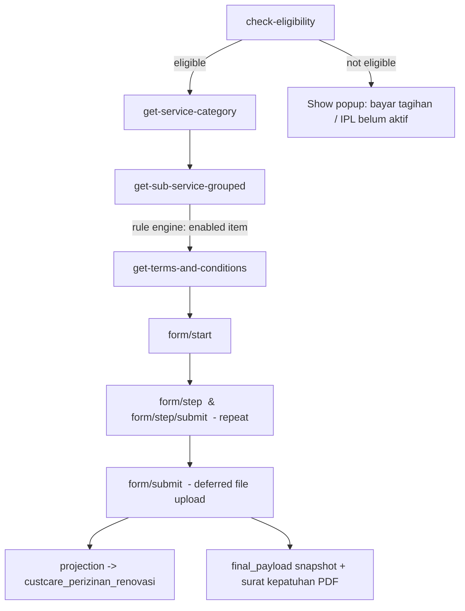

# Intro

:::tip[Penyusun]

- Bazrira Noerfirdiansyah :: Fullstack Developer Senior Associate - Operational Technology

:::

## What this is

This section documents the **revamp of the Customer Care "Document Permit" (perizinan)**
backend. The goal of the revamp was to move the perizinan flow away from **hard-coded
service lists and form logic** baked into `permintaan_izin.service.js` towards a
**DB-driven, server-driven** architecture.

Previously the available sub-services were hard-coded as JavaScript arrays inside the
service file:

```js
// REMOVED during the revamp (services/v1/permintaan_izin.service.js)
const arr_renovasi  = ['PERLUASAN', 'CARPORT', 'PENAMBAHANLUASANBANGUNAN', ...];
const arr_perbaikan = ['Pengecatan', 'Perbaikan Kebocoran', ...];
const arr_lainnya   = ['Pengecoran', 'Pemasangan Logo di Fasade/Totem', ...];
```

These lists — and the validation / eligibility logic around them — are now stored in
the database and driven by a small set of engines. Adding a new service, sub-service,
validation rule, or even a whole new form no longer requires a code change and deploy.

## The four building blocks

| # | Building block | What it does | Page |
| - | -------------- | ------------ | ---- |
| 1 | **Eligibility gate** | Checks IPL activation + outstanding bills (`tunggakan`) before letting a member start a permit, returning a popup-driven response. | [Eligibility & T&C](./eligibility-and-tnc.md) |
| 2 | **Terms & Conditions** | Serves DB-driven T&C (per service, with a global fallback). | [Eligibility & T&C](./eligibility-and-tnc.md) |
| 3 | **Service catalog + rule engine** | Normalized `category → service → group → item` catalog; a pluggable rule engine enables/disables each sub-service item per member. | [Service Catalog](./service-catalog.md) |
| 4 | **Server-driven form wizard** | Multi-step form engine with conditional visibility, prefill, draft persistence, deferred file upload, and projection into typed tables. | [Form Wizard](./form-wizard.md) |

A consolidated reference of every new database table is on the [Data Model](./data-model.md) page.

## End-to-end flow



## Conventions shared by all endpoints

- **Transport:** every endpoint is an HTTP `POST` under the `document-request` path
  prefix on the **Customer Care** service. See the [Base URLs](../base-url.md) page for
  the host per environment. Example absolute path: `…/customer-care/.../document-request/check-eligibility`.
- **Authentication:** the caller passes an `x-auth-token` header. The server resolves it
  to a `Member` via `Member.findOne({ where: { member_authkey: authToken } })`. A missing
  or unknown token returns a failure envelope.
- **Response envelope:** all endpoints return the same shape.

  ```json
  {
    "success": true,
    "msg": "OK",
    "data": {}
  }
  ```

  On failure, `success` is `false`, `msg` carries a human-readable (Indonesian) message,
  and `data` is `[]` or `{}` depending on the endpoint.

- **`client_type`:** the perizinan domain uses `DOCUMENT_PERMISSION` as the default
  `client_type` for T&C lookups.

:::note
This documentation covers branch `revamp-perizinan` (commits `5a86a69` → `bb10526`).
Each page links code symbols and request/response shapes back to the source services so
the docs can be kept in sync as the implementation evolves.
:::
