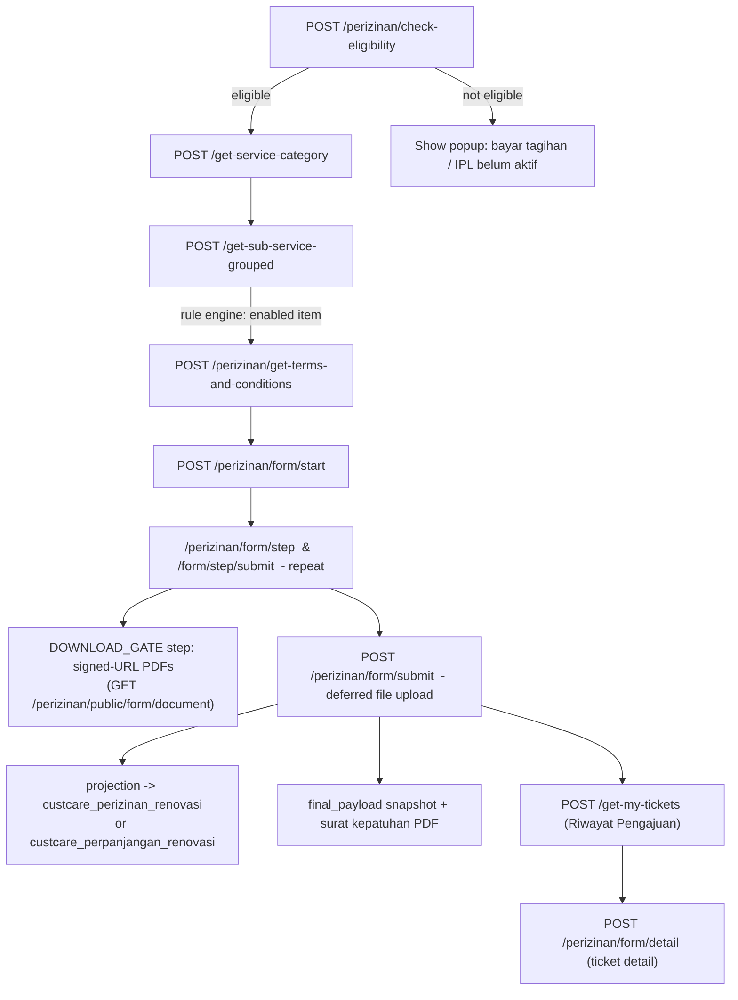

# Intro

:::tip[Penyusun]

- Bazrira Noerfirdiansyah :: Fullstack Developer Senior Associate - Operational Technology

:::

## What this is

This section documents the **revamp of the Customer Care "Document Permit" (perizinan)**
backend. The goal of the revamp was to move the perizinan flow away from **hard-coded
service lists and form logic** baked into `permintaan_izin.service.js` towards a
**DB-driven, server-driven** architecture.

Previously the available sub-services were hard-coded as JavaScript arrays inside the
service file:

```js
// REMOVED during the revamp (services/v1/permintaan_izin.service.js)
const arr_renovasi  = ['PERLUASAN', 'CARPORT', 'PENAMBAHANLUASANBANGUNAN', ...];
const arr_perbaikan = ['Pengecatan', 'Perbaikan Kebocoran', ...];
const arr_lainnya   = ['Pengecoran', 'Pemasangan Logo di Fasade/Totem', ...];
```

These lists — and the validation / eligibility logic around them — are now stored in
the database and driven by a small set of engines. Adding a new service, sub-service,
validation rule, or even a whole new form no longer requires a code change and deploy.

## The four building blocks

| # | Building block | What it does | Page |
| - | -------------- | ------------ | ---- |
| 1 | **Eligibility gate** | Checks IPL activation + outstanding bills (`tunggakan`) before letting a member start a permit, returning a popup-driven response. | [Eligibility & T&C](./eligibility-and-tnc.md) |
| 2 | **Terms & Conditions** | Serves DB-driven T&C (per service, with a global fallback). | [Eligibility & T&C](./eligibility-and-tnc.md) |
| 3 | **Service catalog + rule engine** | Normalized `category → service → group → item` catalog; a pluggable rule engine enables/disables each sub-service item per member. | [Service Catalog](./service-catalog.md) |
| 4 | **Server-driven form wizard** | Multi-step form engine with conditional visibility, prefill, draft persistence, deferred file upload, DB-driven gate documents, date-window validation, perpanjangan carryover, and projection into typed tables. | [Form Wizard](./form-wizard.md) |
| 5 | **Riwayat Pengajuan (My Tickets)** | Unified list of a member's tickets across complaints, pengkinian data, access card, and perizinan submissions, plus per-source detail routing (incl. the perizinan `form/detail`). | [My Tickets](./tickets.md) |

A consolidated reference of every new database table is on the [Data Model](./data-model.md) page.
A summary of what changed since the first revamp cut is on the [Changelog](./changelog.md) page.

## Domain layout

The revamp split the endpoints across three route domains (all mounted under both
`/api/v1` and `/api/v2` on the Customer Care service):

| Domain | Base path | Owns | Source |
| ------ | --------- | ---- | ------ |
| **Perizinan** | `/perizinan/*` | Eligibility gate, T&C, and the whole form wizard. | `routes/v1/perizinan/`, `controllers/v1/perizinan/`, `controllers/v1/customer_care/cc_form.controller.js` |
| **Catalog** | top-level (`/get-service-category`, `/get-sub-service-grouped`) | The DB-driven service catalog + rule engine. | `routes/v1/customer_care/cc_catalog.route.js` |
| **Permintaan izin** | `/document-request/*` | **Legacy only** — appointment scheduling + legacy formulir/PDF generation. No longer serves any perizinan-revamp endpoint. | `routes/v1/permintaan_izin/` |

:::caution Breaking change from the first revamp cut
Every perizinan endpoint used to live under the `/document-request/*` prefix. They were
**moved** into the dedicated `/perizinan` domain (and the catalog endpoints to the top
level). The old `/document-request/*` paths for eligibility, T&C, catalog, and form are
**removed** — clients must call the new paths. See the [Changelog](./changelog.md).
:::

## End-to-end flow


```mermaid
flowchart TD
    A["POST /perizinan/check-eligibility"] -->|eligible| B["POST /get-service-category"]
    A -->|not eligible| A1[Show popup: bayar tagihan / IPL belum aktif]
    B --> C["POST /get-sub-service-grouped"]
    C -->|rule engine: enabled item| D["POST /perizinan/get-terms-and-conditions"]
    D --> E["POST /perizinan/form/start"]
    E --> F["/perizinan/form/step  &  /form/step/submit  - repeat"]
    F --> DG["DOWNLOAD_GATE step: signed-URL PDFs\n(GET /perizinan/public/form/document)"]
    F --> G["POST /perizinan/form/submit  - deferred file upload"]
    G --> H["projection -> custcare_perizinan_renovasi\nor custcare_perpanjangan_renovasi"]
    G --> I[final_payload snapshot + surat kepatuhan PDF]
    G --> J["POST /get-my-tickets (Riwayat Pengajuan)"]
    J --> K["POST /perizinan/form/detail (ticket detail)"]
```

## Conventions shared by all endpoints

- **Transport:** eligibility, T&C, and form endpoints are HTTP `POST` under the
  `/perizinan` path; the catalog endpoints are top-level `POST`. The one exception is the
  gate-document download, a **public** `GET /perizinan/public/form/document` (see
  [Form Wizard](./form-wizard.md#download_gate-steps)). See the [Base URLs](../base-url.md)
  page for the host per environment. Example absolute path:
  `…/customer-care/api/v2/perizinan/check-eligibility`.
- **Authentication:** the caller passes an `x-auth-token` header. The server resolves it
  to a `Member` via `Member.findOne({ where: { member_authkey: authToken } })`. A missing
  or unknown token returns a failure envelope. The public gate-document endpoint is the
  only one that takes **no** `x-auth-token` — its signed `token` query param is the credential.
- **Response envelope:** all endpoints return the same shape.

  ```json
  {
    "success": true,
    "msg": "OK",
    "data": {}
  }
  ```

  On failure, `success` is `false`, `msg` carries a human-readable (Indonesian) message,
  and `data` is `[]` or `{}` depending on the endpoint.

- **`client_type`:** the perizinan domain uses `DOCUMENT_PERMISSION` as the default
  `client_type` for T&C lookups.

:::note
This documentation covers branch `revamp-perizinan` (commits `5a86a69` → `17a82f5`).
Each page links code symbols and request/response shapes back to the source services so
the docs can be kept in sync as the implementation evolves.
:::
