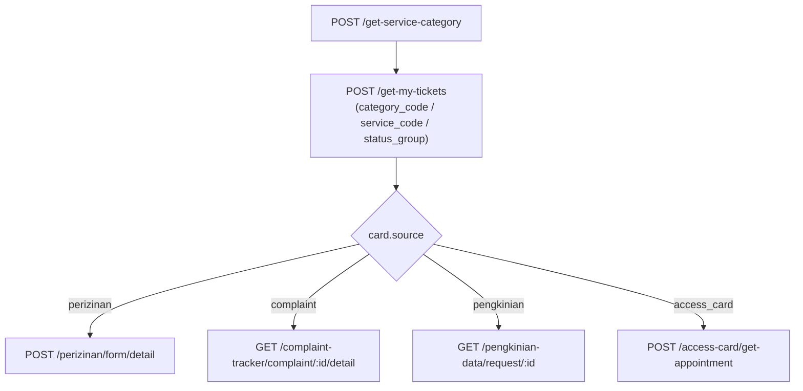

# Riwayat Pengajuan (My Tickets)

:::tip[Penyusun]

- Bazrira Noerfirdiansyah :: Fullstack Developer Senior Associate - Operational Technology

:::

A member's **Riwayat Pengajuan** is a unified list of their tickets across four sources, organized
by the normalized `custcare_service` catalog. The **list** is one endpoint; the **detail** of a
single ticket is fetched **per source, from each feature's own domain endpoint** — a ticket card
tells the client which one to call.

Source: `services/v1/customer_care/cc_tickets.service.js`, wiring in
`controllers/v1/customer_care/cc_tickets.controller.js` and `routes/v1/customer_care/cc_tickets.route.js`.
(Commit `4bf4140`.)

- Base path: top-level under both `/api/v1` and `/api/v2` (full prefix `/customer-care/api/v2/…`).
- Auth: every request sends `x-auth-token: <member_authkey>`.
- Envelope: `{ success, msg, data }`.

## `POST /get-my-tickets`

Returns the member's tickets across four sources, filtered and paginated. Route constant
`CUSTOMER_CARE_ROUTE.MAIN.GET_MY_TICKETS = '/get-my-tickets'`.

| Source | Storage | `category_code` | `service_code` |
| ------ | ------- | --------------- | -------------- |
| `complaint` | `appointment_member` (`COMPLAIN_TRACKER`) | `KELUHAN` | `KELUHAN_BANGUNAN` / `KELUHAN_LINGKUNGAN` / `KELUHAN_AIR_IPL` / `KELUHAN_FINANCE` |
| `pengkinian` | `appointment_member` (`PENGKINIAN_DATA`) | `PERMINTAAN` | `PEMBARUAN_DATA` |
| `access_card` | `appointment_member` (`ACCESS_CARD`) | `PERMINTAAN` | `KARTU_AKSES` |
| `perizinan` | `custcare_form_submission` | `PERMINTAAN` | `IZIN_KERJA_RENOVASI` |

:::note Legacy Izin excluded
The legacy Izin flows (`permintaan_izin` / `perpanjangan_izin`) are intentionally **excluded** — the
perizinan form engine owns Izin Kerja / Renovasi. `PENGAMBILAN_DOKUMEN` is a valid catalog service
but has no backing source here, so filtering by it returns an empty list.
:::

### Request body (all fields optional)

```json
{
  "category_code": "PERMINTAAN",
  "service_code": "IZIN_KERJA_RENOVASI",
  "status_group": "active",
  "page": 1,
  "limit": 10
}
```

| Field | Type | Notes |
| ----- | ---- | ----- |
| `category_code` | string | `KELUHAN` \| `PERMINTAAN`. Empty/omitted = all categories. |
| `service_code` | string | One catalog service code. Empty/omitted = all services in scope. |
| `status_group` | string | `active` \| `history`. Empty/omitted = all statuses. |
| `page` | number | Default `1`. |
| `limit` | number | Default `10`, max `100`. |

> Empty strings are treated as "no filter".

### Response

```json
{
  "success": true,
  "msg": "OK",
  "data": {
    "items": [
      {
        "ticket_id": 9,
        "source": "perizinan",
        "code": "PR12321312",
        "category_code": "PERMINTAAN",
        "category_name": "Permintaan",
        "service_code": "IZIN_KERJA_RENOVASI",
        "service_name": "Izin Kerja / Renovasi",
        "title": "Pengajuan Izin Renovasi",
        "address": null,
        "date": "12 September 2021, 12:30",
        "status": "SUBMITTED",
        "status_label": "Sedang Diproses",
        "status_group": "active",
        "status_color": "#F97316"
      },
      {
        "ticket_id": 1024,
        "source": "complaint",
        "code": "CS-TRK-01024",
        "category_code": "KELUHAN",
        "category_name": "Keluhan",
        "service_code": "KELUHAN_BANGUNAN",
        "service_name": "Bangunan",
        "title": "Bangunan",
        "address": "NavaPark Lyndon Blok A No. 1",
        "date": "24 Agustus 2021, 18:32",
        "status": 1,
        "status_label": "Sedang Diproses",
        "status_group": "active",
        "status_color": "#F97316"
      }
    ],
    "page": 1,
    "limit": 10,
    "total_items": 2,
    "total_pages": 1,
    "current_page": 1
  }
}
```

### Ticket card fields

| Field | Type | Notes |
| ----- | ---- | ----- |
| `ticket_id` | number | Identifier used to fetch detail (see below). |
| `source` | string | `complaint` \| `pengkinian` \| `access_card` \| `perizinan` — **routes the detail call**. |
| `code` | string | Human ticket code (e.g. `CS-TRK-01024`, `PR12321312`). |
| `category_code` / `category_name` | string | Catalog category. |
| `service_code` / `service_name` | string | Catalog service. `service_code` may be `null` for a complaint whose service name isn't mapped. |
| `title` | string | Card title (specific service / form name). |
| `address` | string \| null | `null` for perizinan. |
| `date` | string | `DD MMMM YYYY, HH:mm` (Asia/Jakarta, Indonesian month). |
| `status` | number \| string | Raw source status (number for `appointment_member` sources; string for perizinan). |
| `status_label` | string | Indonesian label. |
| `status_group` | string | `active` \| `history` — drives tab bucketing. |
| `status_color` | string | Hex: active `#F97316`, done `#22C55E`, rejected `#EF4444`, cancelled/expired `#9CA3AF`. |

## Detail — per source

There is **no unified detail endpoint**. The card's `source` tells the client which domain endpoint
to call, and `ticket_id` is the identifier to pass. All four require `x-auth-token` and enforce
member ownership.

| `source` | Method + path | Identifier (from `ticket_id`) | Where |
| -------- | ------------- | ----------------------------- | ----- |
| `perizinan` | `POST /perizinan/form/detail` | `submission_id` (body) | [Form Wizard → `form/detail`](./form-wizard.md#post-perizinanformdetail) |
| `complaint` | `GET /complaint-tracker/complaint/{ticket_id}/detail` | `complaint_id` (path) | complaint_tracker domain |
| `pengkinian` | `GET /pengkinian-data/request/{ticket_id}` | `request_id` (path) | pengkinian_data domain |
| `access_card` | `POST /access-card/get-appointment` | `appointment_id` (body) | access_card domain |

- **`perizinan`** — the new form-engine detail; see its full response shape in
  [Form Wizard](./form-wizard.md#post-perizinanformdetail).
- **`complaint`** — existing complaint_tracker endpoint; returns the complaint detail (items, status,
  address, visit journey, review) as a flat mapped object under `data`, plus top-level `is_agent`.
- **`pengkinian`** — existing pengkinian_data endpoint; returns
  `{ data: { id, type, appointment_code, appointment_date, estimated_days, estimated_date, status, notes, member, items[], readable, editable, deletable, chat }, meta: { title } }`.
- **`access_card`** — existing access_card endpoint; body
  `{ "appointment_id": <ticket_id>, "clientType": "ACCESS_CARD" }`; returns the appointment detail
  decorated with QR, status label/color, form data, documents, and info sections under `data`.

## Client flow



1. Render tabs/sub-tabs from `POST /get-service-category` (categories → services; see
   [Service Catalog](./service-catalog.md)).
2. On tab/sub-tab select, call `POST /get-my-tickets` with `category_code` / `service_code`.
3. On card tap, branch on `source` and call the matching detail endpoint with `ticket_id`.
