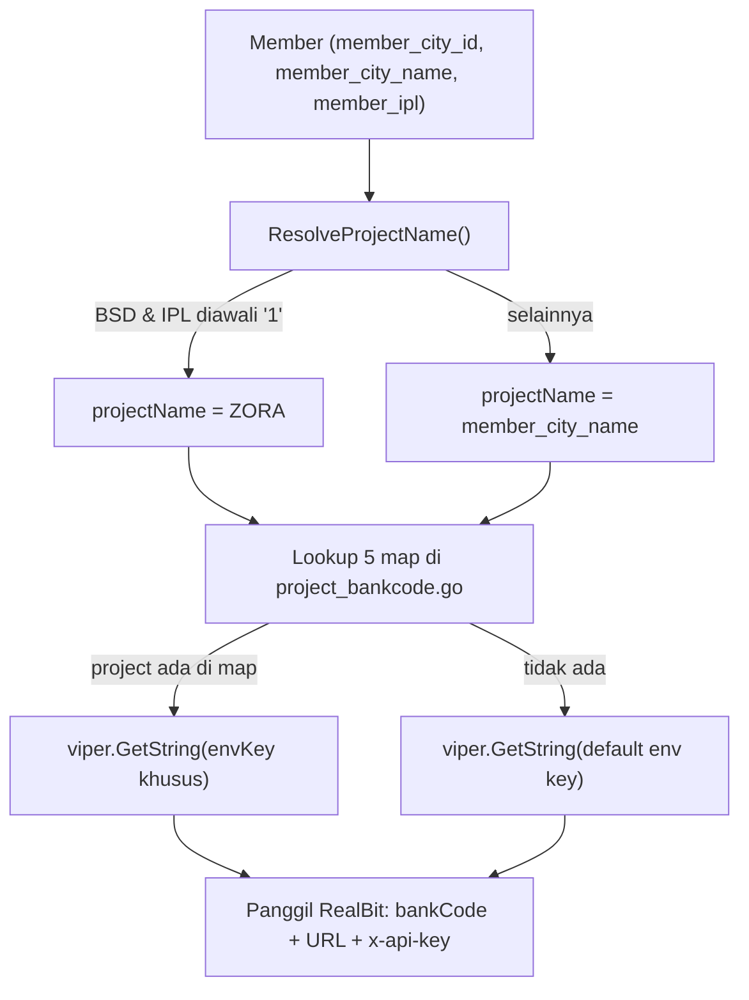

# Menambah Kota Baru (Multicity)

:::tip[Penyusun]

- Bazrira Noerfirdiansyah :: Fullstack Developer Senior Associate - Operational Technology

:::

## Konsep

Servis ini mendukung banyak kota/**proyek**. Yang dimaksud "proyek" adalah **target routing
RealBit** — yaitu penentu **bank code**, **URL API**, dan **x-api-key** yang dipakai saat servis
memanggil RealBit untuk mengambil data tagihan seorang member.

Nama proyek **diturunkan dari `member.member_city_name`** (string kota dipakai langsung sebagai
kunci map), dengan satu pengecualian _override_ sintetis: member **BSD** yang nomor IPL-nya
diawali `"1"` diarahkan ke proyek virtual **`ZORA`**. `ZORA` bukan kota nyata — ia hanya nama
proyek hasil override.

Proyek yang ada saat ini: **`BSD`** (default implisit), **`ZORA`**, dan **`Balikpapan`**.

Kolom `member_city_id` (UUID) dipakai **hanya** pada override ZORA untuk memastikan aturan
"IPL diawali 1" hanya berlaku bagi member BSD asli (dibandingkan dengan konstanta
`bsdMemberCityID`), bukan untuk semua kota.

## Mekanisme routing

Titik pusatnya ada di `pkg/realbit/project_bankcode.go`:

- **`ResolveProjectName(memberCityID, memberCityName, memberIpl)`** — mengembalikan `"ZORA"` bila
  `memberCityID == bsdMemberCityID` **dan** `memberIpl` diawali `"1"`; selain itu mengembalikan
  `memberCityName` apa adanya.
- Lima **map `project → envKey`**, masing-masing punya _default env key_ sebagai _fallback_:

  | Fungsi | Map | Default env key |
  | ------ | --- | --------------- |
  | `GetBankCodeByProject` | `projectBankCodeMap` | `REALBIT_PARAM_BANKCODE` |
  | `GetBillHistoryURLByProject` | `projectBillHistoryURLMap` | `REALBIT_URL_BILLHISTORY` |
  | `GetOutstandingGeneralURLByProject` | `projectOutstandingGeneralURLMap` | `REALBIT_URL_GETOUTSTANDINGGENERAL` |
  | `GetBillOutstandingURLByProject` | `projectBillOutstandingURLMap` | `REALBIT_URL_GETBILLOUTSTANDING` |
  | `GetXApiKeyByProject` | `projectXApiKeyMap` | `REALBIT_HEADER_XAPIKEY` |

Setiap fungsi berpola sama: bila `projectName` ada di map → pakai `viper.GetString(envKey)`;
bila tidak → pakai default env key. Nilai env dibaca via Viper dari file `.env` dan/atau
environment variable OS (`cmd/commands/root.go`).

Info kota member diambil dari DB oleh
`FindOneRealbitCodeByMemberIpl` (`app/ipl/repository/repository-ipl/repository-ipl.go:38`), lalu
`ResolveProjectName` dipanggil di dalam `getBankCodeForMember` pada tiga service:
`bill.go:40`, `payment.go:51`, dan `statistic.go:32`. Hasilnya (`bankCode` + `projectName`)
diteruskan ke klien RealBit (`pkg/realbit/realbitimpl/realbit.go`).



## Langkah menambah kota baru

Contoh: kota **`Surabaya`** dengan singkatan `SBY`.

### 1. Data (prasyarat)

Pastikan member kota tersebut memiliki `member.member_city_name = "Surabaya"` beserta
`member_city_id`. **Kunci map harus sama persis** dengan `member_city_name`, karena
`ResolveProjectName` mengembalikan `member_city_name` apa adanya (contoh `Balikpapan` berhasil
justru karena kuncinya sama dengan nama kota lengkap). Ini prasyarat data, bukan perubahan kode.

### 2. Tambahkan entri map di `pkg/realbit/project_bankcode.go`

```go
// projectBankCodeMap
"Surabaya": "REALBIT_SBY_BANKCODE",

// projectOutstandingGeneralURLMap
"Surabaya": "REALBIT_URL_GETOUTSTANDINGGENERAL_SBY",

// projectBillOutstandingURLMap
"Surabaya": "REALBIT_URL_GETBILLOUTSTANDING_SBY",

// projectXApiKeyMap
"Surabaya": "REALBIT_HEADER_XAPIKEY_SBY",

// projectBillHistoryURLMap (untuk konsistensi; lihat catatan di bawah)
"Surabaya": "REALBIT_URL_BILLHISTORY_SBY",
```

Bila satu kategori sengaja tidak dimasukkan ke suatu map, kategori itu akan memakai default env
key untuk aspek tersebut.

### 3. Definisikan environment variable

Tambahkan di `.env` tiap environment (dan perbarui `.env.example` + `AGENTS.md`):

```bash
REALBIT_SBY_BANKCODE=...
REALBIT_URL_GETOUTSTANDINGGENERAL_SBY=...
REALBIT_URL_GETBILLOUTSTANDING_SBY=...
REALBIT_HEADER_XAPIKEY_SBY=...
REALBIT_URL_BILLHISTORY_SBY=...   # bila entri history map ditambahkan
```

### 4. Override khusus (opsional)

Kota biasa **tidak** memerlukan override — `ResolveProjectName` cukup mengembalikan
`member_city_name` dan map menangani sisanya. Tambahkan cabang baru di `ResolveProjectName`
**hanya** bila kota baru butuh routing sintetis seperti ZORA (mis. memecah satu `member_city_id`
menjadi beberapa proyek berdasarkan awalan IPL). Itu juga perlu konstanta city-id baru serupa
`bsdMemberCityID`.

### 5. Tidak perlu ubah layer lain

`bill.go`, `payment.go`, `statistic.go`, `realbit.go`, dan repository sudah _project-agnostic_ —
semuanya melewati `ResolveProjectName` + map. Ketiga `getBankCodeForMember` sudah meneruskan
`member_city_id`/`member_city_name`.

**Minimal untuk kota normal:** Langkah 1 (data) + Langkah 2 (entri map) + Langkah 3 (env var).
Langkah 4–5 umumnya tidak diperlukan.

## Catatan penting

:::caution Perhatikan hal berikut

- **`BSD` hanya ada di `projectBankCodeMap`**, tidak di map URL/x-api-key. Jadi member dengan
  `member_city_name == "BSD"` memakai bank code khusus (`REALBIT_BSD_BANKCODE`) tetapi URL &
  x-api-key **default**.
- **`projectBillHistoryURLMap` / `GetBillHistoryURLByProject` saat ini tidak dipanggil.** Alur
  `BillHistory` memakai `GetBillOutstandingURLByProject`. Entri pada history map ditambahkan hanya
  demi konsistensi.
- **Env per-proyek belum terdokumentasi.** Variabel `*_ZORA`, `*_BPN`, dan `REALBIT_BSD_BANKCODE`
  dirujuk di kode namun belum tercantum di `.env.example` maupun `AGENTS.md` — sebaiknya
  dilengkapi saat menambah kota baru.

:::

## Referensi kode

| Berkas | Peran |
| ------ | ----- |
| `pkg/realbit/project_bankcode.go` | Semua map, `ResolveProjectName`, `bsdMemberCityID`. |
| `pkg/realbit/realbitimpl/realbit.go` | Klien RealBit yang mengonsumsi hasil routing. |
| `app/ipl/usecase/usecaseimpl/bill.go` · `payment.go` · `statistic.go` | `getBankCodeForMember`. |
| `app/ipl/repository/repository-ipl/repository-ipl.go` | `FindOneRealbitCodeByMemberIpl` (sumber `member_city_id`/`member_city_name`). |
| `cmd/commands/root.go` | Pemuatan konfigurasi Viper (`.env` + env OS). |
